# Projects and dependencies analysis

This document provides a comprehensive overview of the projects and their dependencies in the context of upgrading to .NETCoreApp,Version=v10.0.

## Table of Contents

- [Executive Summary](#executive-Summary)
  - [Highlevel Metrics](#highlevel-metrics)
  - [Projects Compatibility](#projects-compatibility)
  - [Package Compatibility](#package-compatibility)
  - [API Compatibility](#api-compatibility)
- [Aggregate NuGet packages details](#aggregate-nuget-packages-details)
- [Top API Migration Challenges](#top-api-migration-challenges)
  - [Technologies and Features](#technologies-and-features)
  - [Most Frequent API Issues](#most-frequent-api-issues)
- [Projects Relationship Graph](#projects-relationship-graph)
- [Project Details](#project-details)

  - [Enigmatry.Entry.AspNetCore.Authorization.Tests\Enigmatry.Entry.AspNetCore.Authorization.Tests.csproj](#enigmatryentryaspnetcoreauthorizationtestsenigmatryentryaspnetcoreauthorizationtestscsproj)
  - [Enigmatry.Entry.AspNetCore.Authorization\Enigmatry.Entry.AspNetCore.Authorization.csproj](#enigmatryentryaspnetcoreauthorizationenigmatryentryaspnetcoreauthorizationcsproj)
  - [Enigmatry.Entry.AspNetCore.Tests.NewtonsoftJson.Tests\Enigmatry.Entry.AspNetCore.Tests.NewtonsoftJson.Tests.csproj](#enigmatryentryaspnetcoretestsnewtonsoftjsontestsenigmatryentryaspnetcoretestsnewtonsoftjsontestscsproj)
  - [Enigmatry.Entry.AspNetCore.Tests.NewtonsoftJson\Enigmatry.Entry.AspNetCore.Tests.NewtonsoftJson.csproj](#enigmatryentryaspnetcoretestsnewtonsoftjsonenigmatryentryaspnetcoretestsnewtonsoftjsoncsproj)
  - [Enigmatry.Entry.AspNetCore.Tests.SampleApp\Enigmatry.Entry.AspNetCore.Tests.SampleApp.csproj](#enigmatryentryaspnetcoretestssampleappenigmatryentryaspnetcoretestssampleappcsproj)
  - [Enigmatry.Entry.AspNetCore.Tests.SystemTextJson.Tests\Enigmatry.Entry.AspNetCore.Tests.SystemTextJson.Tests.csproj](#enigmatryentryaspnetcoretestssystemtextjsontestsenigmatryentryaspnetcoretestssystemtextjsontestscsproj)
  - [Enigmatry.Entry.AspNetCore.Tests.SystemTextJson\Enigmatry.Entry.AspNetCore.Tests.SystemTextJson.csproj](#enigmatryentryaspnetcoretestssystemtextjsonenigmatryentryaspnetcoretestssystemtextjsoncsproj)
  - [Enigmatry.Entry.AspNetCore.Tests.Utilities\Enigmatry.Entry.AspNetCore.Tests.Utilities.csproj](#enigmatryentryaspnetcoretestsutilitiesenigmatryentryaspnetcoretestsutilitiescsproj)
  - [Enigmatry.Entry.AspNetCore.Tests\Enigmatry.Entry.AspNetCore.Tests.csproj](#enigmatryentryaspnetcoretestsenigmatryentryaspnetcoretestscsproj)
  - [Enigmatry.Entry.AspNetCore\Enigmatry.Entry.AspNetCore.csproj](#enigmatryentryaspnetcoreenigmatryentryaspnetcorecsproj)
  - [Enigmatry.Entry.AzureSearch.Tests\Enigmatry.Entry.AzureSearch.Tests.csproj](#enigmatryentryazuresearchtestsenigmatryentryazuresearchtestscsproj)
  - [Enigmatry.Entry.AzureSearch\Enigmatry.Entry.AzureSearch.csproj](#enigmatryentryazuresearchenigmatryentryazuresearchcsproj)
  - [Enigmatry.Entry.BlobStorage.Tests\Enigmatry.Entry.BlobStorage.Tests.csproj](#enigmatryentryblobstoragetestsenigmatryentryblobstoragetestscsproj)
  - [Enigmatry.Entry.BlobStorage\Enigmatry.Entry.BlobStorage.csproj](#enigmatryentryblobstorageenigmatryentryblobstoragecsproj)
  - [Enigmatry.Entry.Core.EntityFramework\Enigmatry.Entry.Core.EntityFramework.csproj](#enigmatryentrycoreentityframeworkenigmatryentrycoreentityframeworkcsproj)
  - [Enigmatry.Entry.Core.Tests\Enigmatry.Entry.Core.Tests.csproj](#enigmatryentrycoretestsenigmatryentrycoretestscsproj)
  - [Enigmatry.Entry.Core\Enigmatry.Entry.Core.csproj](#enigmatryentrycoreenigmatryentrycorecsproj)
  - [Enigmatry.Entry.Csv.Tests\Enigmatry.Entry.Csv.Tests.csproj](#enigmatryentrycsvtestsenigmatryentrycsvtestscsproj)
  - [Enigmatry.Entry.Csv\Enigmatry.Entry.Csv.csproj](#enigmatryentrycsvenigmatryentrycsvcsproj)
  - [Enigmatry.Entry.Email.Tests\Enigmatry.Entry.Email.Tests.csproj](#enigmatryentryemailtestsenigmatryentryemailtestscsproj)
  - [Enigmatry.Entry.EmailClient\Enigmatry.Entry.Email.csproj](#enigmatryentryemailclientenigmatryentryemailcsproj)
  - [Enigmatry.Entry.EntityFramework.Tests\Enigmatry.Entry.EntityFramework.Tests.csproj](#enigmatryentryentityframeworktestsenigmatryentryentityframeworktestscsproj)
  - [Enigmatry.Entry.EntityFramework\Enigmatry.Entry.EntityFramework.csproj](#enigmatryentryentityframeworkenigmatryentryentityframeworkcsproj)
  - [Enigmatry.Entry.GraphApi\Enigmatry.Entry.GraphApi.csproj](#enigmatryentrygraphapienigmatryentrygraphapicsproj)
  - [Enigmatry.Entry.HealthChecks.Tests\Enigmatry.Entry.HealthChecks.Tests.csproj](#enigmatryentryhealthcheckstestsenigmatryentryhealthcheckstestscsproj)
  - [Enigmatry.Entry.HealthChecks\Enigmatry.Entry.HealthChecks.csproj](#enigmatryentryhealthchecksenigmatryentryhealthcheckscsproj)
  - [Enigmatry.Entry.Infrastructure.Tests\Enigmatry.Entry.Infrastructure.Tests.csproj](#enigmatryentryinfrastructuretestsenigmatryentryinfrastructuretestscsproj)
  - [Enigmatry.Entry.Infrastructure\Enigmatry.Entry.Infrastructure.csproj](#enigmatryentryinfrastructureenigmatryentryinfrastructurecsproj)
  - [Enigmatry.Entry.MediatR.Tests\Enigmatry.Entry.MediatR.Tests.csproj](#enigmatryentrymediatrtestsenigmatryentrymediatrtestscsproj)
  - [Enigmatry.Entry.MediatR\Enigmatry.Entry.MediatR.csproj](#enigmatryentrymediatrenigmatryentrymediatrcsproj)
  - [Enigmatry.Entry.Randomness\Enigmatry.Entry.Randomness.csproj](#enigmatryentryrandomnessenigmatryentryrandomnesscsproj)
  - [Enigmatry.Entry.Scheduler.Tests\Enigmatry.Entry.Scheduler.Tests.csproj](#enigmatryentryschedulertestsenigmatryentryschedulertestscsproj)
  - [Enigmatry.Entry.Scheduler\Enigmatry.Entry.Scheduler.csproj](#enigmatryentryschedulerenigmatryentryschedulercsproj)
  - [Enigmatry.Entry.SmartEnums.EntityFramework\Enigmatry.Entry.SmartEnums.EntityFramework.csproj](#enigmatryentrysmartenumsentityframeworkenigmatryentrysmartenumsentityframeworkcsproj)
  - [Enigmatry.Entry.SmartEnums.Swagger\Enigmatry.Entry.SmartEnums.Swagger.csproj](#enigmatryentrysmartenumsswaggerenigmatryentrysmartenumsswaggercsproj)
  - [Enigmatry.Entry.SmartEnums.SystemTextJson\Enigmatry.Entry.SmartEnums.SystemTextJson.csproj](#enigmatryentrysmartenumssystemtextjsonenigmatryentrysmartenumssystemtextjsoncsproj)
  - [Enigmatry.Entry.SmartEnums.VerifyTests\Enigmatry.Entry.SmartEnums.VerifyTests.csproj](#enigmatryentrysmartenumsverifytestsenigmatryentrysmartenumsverifytestscsproj)
  - [Enigmatry.Entry.SmartEnums\Enigmatry.Entry.SmartEnums.csproj](#enigmatryentrysmartenumsenigmatryentrysmartenumscsproj)
  - [Enigmatry.Entry.SwaggerSecurity\Enigmatry.Entry.Swagger.csproj](#enigmatryentryswaggersecurityenigmatryentryswaggercsproj)
  - [Enigmatry.Entry.TemplatingEngine.Fluid.Tests\Enigmatry.Entry.TemplatingEngine.Fluid.Tests.csproj](#enigmatryentrytemplatingenginefluidtestsenigmatryentrytemplatingenginefluidtestscsproj)
  - [Enigmatry.Entry.TemplatingEngine.Fluid\Enigmatry.Entry.TemplatingEngine.Fluid.csproj](#enigmatryentrytemplatingenginefluidenigmatryentrytemplatingenginefluidcsproj)
  - [Enigmatry.Entry.TemplatingEngine.Razor.Tests\Enigmatry.Entry.TemplatingEngine.Razor.Tests.csproj](#enigmatryentrytemplatingenginerazortestsenigmatryentrytemplatingenginerazortestscsproj)
  - [Enigmatry.Entry.TemplatingEngine.Razor\Enigmatry.Entry.TemplatingEngine.Razor.csproj](#enigmatryentrytemplatingenginerazorenigmatryentrytemplatingenginerazorcsproj)

## Executive Summary

### Highlevel Metrics

| Metric | Count | Status |
| :--- | :---: | :--- |
| Total Projects | 43 | All require upgrade |
| Total NuGet Packages | 70 | 23 need upgrade |
| Total Code Files | 295 |  |
| Total Code Files with Incidents | 78 |  |
| Total Lines of Code | 11096 |  |
| Total Number of Issues | 212 |  |
| Estimated LOC to modify | 114+ | at least 1,0% of codebase |

### Projects Compatibility

| Project | Target Framework | Difficulty | Package Issues | API Issues | Est. LOC Impact | Description |
| :--- | :---: | :---: | :---: | :---: | :---: | :--- |
| [Enigmatry.Entry.AspNetCore.Authorization.Tests\Enigmatry.Entry.AspNetCore.Authorization.Tests.csproj](#enigmatryentryaspnetcoreauthorizationtestsenigmatryentryaspnetcoreauthorizationtestscsproj) | net9.0 | 🟢 Low | 0 | 0 |  | DotNetCoreApp, Sdk Style = True |
| [Enigmatry.Entry.AspNetCore.Authorization\Enigmatry.Entry.AspNetCore.Authorization.csproj](#enigmatryentryaspnetcoreauthorizationenigmatryentryaspnetcoreauthorizationcsproj) | net9.0 | 🟢 Low | 0 | 0 |  | ClassLibrary, Sdk Style = True |
| [Enigmatry.Entry.AspNetCore.Tests.NewtonsoftJson.Tests\Enigmatry.Entry.AspNetCore.Tests.NewtonsoftJson.Tests.csproj](#enigmatryentryaspnetcoretestsnewtonsoftjsontestsenigmatryentryaspnetcoretestsnewtonsoftjsontestscsproj) | net9.0 | 🟢 Low | 1 | 0 |  | DotNetCoreApp, Sdk Style = True |
| [Enigmatry.Entry.AspNetCore.Tests.NewtonsoftJson\Enigmatry.Entry.AspNetCore.Tests.NewtonsoftJson.csproj](#enigmatryentryaspnetcoretestsnewtonsoftjsonenigmatryentryaspnetcoretestsnewtonsoftjsoncsproj) | net9.0 | 🟢 Low | 0 | 24 | 24+ | ClassLibrary, Sdk Style = True |
| [Enigmatry.Entry.AspNetCore.Tests.SampleApp\Enigmatry.Entry.AspNetCore.Tests.SampleApp.csproj](#enigmatryentryaspnetcoretestssampleappenigmatryentryaspnetcoretestssampleappcsproj) | net9.0 | 🟢 Low | 1 | 0 |  | AspNetCore, Sdk Style = True |
| [Enigmatry.Entry.AspNetCore.Tests.SystemTextJson.Tests\Enigmatry.Entry.AspNetCore.Tests.SystemTextJson.Tests.csproj](#enigmatryentryaspnetcoretestssystemtextjsontestsenigmatryentryaspnetcoretestssystemtextjsontestscsproj) | net9.0 | 🟢 Low | 0 | 0 |  | DotNetCoreApp, Sdk Style = True |
| [Enigmatry.Entry.AspNetCore.Tests.SystemTextJson\Enigmatry.Entry.AspNetCore.Tests.SystemTextJson.csproj](#enigmatryentryaspnetcoretestssystemtextjsonenigmatryentryaspnetcoretestssystemtextjsoncsproj) | net9.0 | 🟢 Low | 0 | 8 | 8+ | ClassLibrary, Sdk Style = True |
| [Enigmatry.Entry.AspNetCore.Tests.Utilities\Enigmatry.Entry.AspNetCore.Tests.Utilities.csproj](#enigmatryentryaspnetcoretestsutilitiesenigmatryentryaspnetcoretestsutilitiescsproj) | net9.0 | 🟢 Low | 2 | 6 | 6+ | ClassLibrary, Sdk Style = True |
| [Enigmatry.Entry.AspNetCore.Tests\Enigmatry.Entry.AspNetCore.Tests.csproj](#enigmatryentryaspnetcoretestsenigmatryentryaspnetcoretestscsproj) | net9.0 | 🟢 Low | 1 | 5 | 5+ | DotNetCoreApp, Sdk Style = True |
| [Enigmatry.Entry.AspNetCore\Enigmatry.Entry.AspNetCore.csproj](#enigmatryentryaspnetcoreenigmatryentryaspnetcorecsproj) | net9.0 | 🟢 Low | 0 | 2 | 2+ | ClassLibrary, Sdk Style = True |
| [Enigmatry.Entry.AzureSearch.Tests\Enigmatry.Entry.AzureSearch.Tests.csproj](#enigmatryentryazuresearchtestsenigmatryentryazuresearchtestscsproj) | net9.0 | 🟢 Low | 5 | 5 | 5+ | DotNetCoreApp, Sdk Style = True |
| [Enigmatry.Entry.AzureSearch\Enigmatry.Entry.AzureSearch.csproj](#enigmatryentryazuresearchenigmatryentryazuresearchcsproj) | net9.0 | 🟢 Low | 5 | 8 | 8+ | ClassLibrary, Sdk Style = True |
| [Enigmatry.Entry.BlobStorage.Tests\Enigmatry.Entry.BlobStorage.Tests.csproj](#enigmatryentryblobstoragetestsenigmatryentryblobstoragetestscsproj) | net9.0 | 🟢 Low | 0 | 18 | 18+ | DotNetCoreApp, Sdk Style = True |
| [Enigmatry.Entry.BlobStorage\Enigmatry.Entry.BlobStorage.csproj](#enigmatryentryblobstorageenigmatryentryblobstoragecsproj) | net9.0 | 🟢 Low | 7 | 11 | 11+ | ClassLibrary, Sdk Style = True |
| [Enigmatry.Entry.Core.EntityFramework\Enigmatry.Entry.Core.EntityFramework.csproj](#enigmatryentrycoreentityframeworkenigmatryentrycoreentityframeworkcsproj) | net9.0 | 🟢 Low | 1 | 0 |  | ClassLibrary, Sdk Style = True |
| [Enigmatry.Entry.Core.Tests\Enigmatry.Entry.Core.Tests.csproj](#enigmatryentrycoretestsenigmatryentrycoretestscsproj) | net9.0 | 🟢 Low | 0 | 0 |  | DotNetCoreApp, Sdk Style = True |
| [Enigmatry.Entry.Core\Enigmatry.Entry.Core.csproj](#enigmatryentrycoreenigmatryentrycorecsproj) | net9.0 | 🟢 Low | 2 | 0 |  | ClassLibrary, Sdk Style = True |
| [Enigmatry.Entry.Csv.Tests\Enigmatry.Entry.Csv.Tests.csproj](#enigmatryentrycsvtestsenigmatryentrycsvtestscsproj) | net9.0 | 🟢 Low | 0 | 0 |  | DotNetCoreApp, Sdk Style = True |
| [Enigmatry.Entry.Csv\Enigmatry.Entry.Csv.csproj](#enigmatryentrycsvenigmatryentrycsvcsproj) | net9.0 | 🟢 Low | 0 | 0 |  | ClassLibrary, Sdk Style = True |
| [Enigmatry.Entry.Email.Tests\Enigmatry.Entry.Email.Tests.csproj](#enigmatryentryemailtestsenigmatryentryemailtestscsproj) | net9.0 | 🟢 Low | 2 | 0 |  | DotNetCoreApp, Sdk Style = True |
| [Enigmatry.Entry.EmailClient\Enigmatry.Entry.Email.csproj](#enigmatryentryemailclientenigmatryentryemailcsproj) | net9.0 | 🟢 Low | 4 | 2 | 2+ | ClassLibrary, Sdk Style = True |
| [Enigmatry.Entry.EntityFramework.Tests\Enigmatry.Entry.EntityFramework.Tests.csproj](#enigmatryentryentityframeworktestsenigmatryentryentityframeworktestscsproj) | net9.0 | 🟢 Low | 2 | 0 |  | DotNetCoreApp, Sdk Style = True |
| [Enigmatry.Entry.EntityFramework\Enigmatry.Entry.EntityFramework.csproj](#enigmatryentryentityframeworkenigmatryentryentityframeworkcsproj) | net9.0 | 🟢 Low | 3 | 0 |  | ClassLibrary, Sdk Style = True |
| [Enigmatry.Entry.GraphApi\Enigmatry.Entry.GraphApi.csproj](#enigmatryentrygraphapienigmatryentrygraphapicsproj) | net9.0 | 🟢 Low | 3 | 2 | 2+ | ClassLibrary, Sdk Style = True |
| [Enigmatry.Entry.HealthChecks.Tests\Enigmatry.Entry.HealthChecks.Tests.csproj](#enigmatryentryhealthcheckstestsenigmatryentryhealthcheckstestscsproj) | net9.0 | 🟢 Low | 0 | 0 |  | DotNetCoreApp, Sdk Style = True |
| [Enigmatry.Entry.HealthChecks\Enigmatry.Entry.HealthChecks.csproj](#enigmatryentryhealthchecksenigmatryentryhealthcheckscsproj) | net9.0 | 🟢 Low | 0 | 1 | 1+ | ClassLibrary, Sdk Style = True |
| [Enigmatry.Entry.Infrastructure.Tests\Enigmatry.Entry.Infrastructure.Tests.csproj](#enigmatryentryinfrastructuretestsenigmatryentryinfrastructuretestscsproj) | net9.0 | 🟢 Low | 0 | 2 | 2+ | DotNetCoreApp, Sdk Style = True |
| [Enigmatry.Entry.Infrastructure\Enigmatry.Entry.Infrastructure.csproj](#enigmatryentryinfrastructureenigmatryentryinfrastructurecsproj) | net9.0 | 🟢 Low | 0 | 0 |  | ClassLibrary, Sdk Style = True |
| [Enigmatry.Entry.MediatR.Tests\Enigmatry.Entry.MediatR.Tests.csproj](#enigmatryentrymediatrtestsenigmatryentrymediatrtestscsproj) | net9.0 | 🟢 Low | 0 | 1 | 1+ | DotNetCoreApp, Sdk Style = True |
| [Enigmatry.Entry.MediatR\Enigmatry.Entry.MediatR.csproj](#enigmatryentrymediatrenigmatryentrymediatrcsproj) | net9.0 | 🟢 Low | 1 | 0 |  | ClassLibrary, Sdk Style = True |
| [Enigmatry.Entry.Randomness\Enigmatry.Entry.Randomness.csproj](#enigmatryentryrandomnessenigmatryentryrandomnesscsproj) | net9.0 | 🟢 Low | 1 | 0 |  | ClassLibrary, Sdk Style = True |
| [Enigmatry.Entry.Scheduler.Tests\Enigmatry.Entry.Scheduler.Tests.csproj](#enigmatryentryschedulertestsenigmatryentryschedulertestscsproj) | net9.0 | 🟢 Low | 1 | 8 | 8+ | DotNetCoreApp, Sdk Style = True |
| [Enigmatry.Entry.Scheduler\Enigmatry.Entry.Scheduler.csproj](#enigmatryentryschedulerenigmatryentryschedulercsproj) | net9.0 | 🟢 Low | 1 | 10 | 10+ | ClassLibrary, Sdk Style = True |
| [Enigmatry.Entry.SmartEnums.EntityFramework\Enigmatry.Entry.SmartEnums.EntityFramework.csproj](#enigmatryentrysmartenumsentityframeworkenigmatryentrysmartenumsentityframeworkcsproj) | net9.0 | 🟢 Low | 1 | 0 |  | ClassLibrary, Sdk Style = True |
| [Enigmatry.Entry.SmartEnums.Swagger\Enigmatry.Entry.SmartEnums.Swagger.csproj](#enigmatryentrysmartenumsswaggerenigmatryentrysmartenumsswaggercsproj) | net9.0 | 🟢 Low | 0 | 0 |  | ClassLibrary, Sdk Style = True |
| [Enigmatry.Entry.SmartEnums.SystemTextJson\Enigmatry.Entry.SmartEnums.SystemTextJson.csproj](#enigmatryentrysmartenumssystemtextjsonenigmatryentrysmartenumssystemtextjsoncsproj) | net9.0 | 🟢 Low | 0 | 0 |  | ClassLibrary, Sdk Style = True |
| [Enigmatry.Entry.SmartEnums.VerifyTests\Enigmatry.Entry.SmartEnums.VerifyTests.csproj](#enigmatryentrysmartenumsverifytestsenigmatryentrysmartenumsverifytestscsproj) | net9.0 | 🟢 Low | 0 | 0 |  | ClassLibrary, Sdk Style = True |
| [Enigmatry.Entry.SmartEnums\Enigmatry.Entry.SmartEnums.csproj](#enigmatryentrysmartenumsenigmatryentrysmartenumscsproj) | net9.0 | 🟢 Low | 0 | 0 |  | ClassLibrary, Sdk Style = True |
| [Enigmatry.Entry.SwaggerSecurity\Enigmatry.Entry.Swagger.csproj](#enigmatryentryswaggersecurityenigmatryentryswaggercsproj) | net9.0 | 🟢 Low | 1 | 0 |  | ClassLibrary, Sdk Style = True |
| [Enigmatry.Entry.TemplatingEngine.Fluid.Tests\Enigmatry.Entry.TemplatingEngine.Fluid.Tests.csproj](#enigmatryentrytemplatingenginefluidtestsenigmatryentrytemplatingenginefluidtestscsproj) | net9.0 | 🟢 Low | 2 | 0 |  | DotNetCoreApp, Sdk Style = True |
| [Enigmatry.Entry.TemplatingEngine.Fluid\Enigmatry.Entry.TemplatingEngine.Fluid.csproj](#enigmatryentrytemplatingenginefluidenigmatryentrytemplatingenginefluidcsproj) | net9.0 | 🟢 Low | 3 | 0 |  | ClassLibrary, Sdk Style = True |
| [Enigmatry.Entry.TemplatingEngine.Razor.Tests\Enigmatry.Entry.TemplatingEngine.Razor.Tests.csproj](#enigmatryentrytemplatingenginerazortestsenigmatryentrytemplatingenginerazortestscsproj) | net9.0 | 🟢 Low | 3 | 1 | 1+ | DotNetCoreApp, Sdk Style = True |
| [Enigmatry.Entry.TemplatingEngine.Razor\Enigmatry.Entry.TemplatingEngine.Razor.csproj](#enigmatryentrytemplatingenginerazorenigmatryentrytemplatingenginerazorcsproj) | net9.0 | 🟢 Low | 2 | 0 |  | ClassLibrary, Sdk Style = True |

### Package Compatibility

| Status | Count | Percentage |
| :--- | :---: | :---: |
| ✅ Compatible | 47 | 67,1% |
| ⚠️ Incompatible | 0 | 0,0% |
| 🔄 Upgrade Recommended | 23 | 32,9% |
| ***Total NuGet Packages*** | ***70*** | ***100%*** |

### API Compatibility

| Category | Count | Impact |
| :--- | :---: | :--- |
| 🔴 Binary Incompatible | 10 | High - Require code changes |
| 🟡 Source Incompatible | 35 | Medium - Needs re-compilation and potential conflicting API error fixing |
| 🔵 Behavioral change | 69 | Low - Behavioral changes that may require testing at runtime |
| ✅ Compatible | 11172 |  |
| ***Total APIs Analyzed*** | ***11286*** |  |

## Aggregate NuGet packages details

| Package | Current Version | Suggested Version | Projects | Description |
| :--- | :---: | :---: | :--- | :--- |
| Ardalis.SmartEnum | 8.2.0 |  | [Enigmatry.Entry.SmartEnums.csproj](#enigmatryentrysmartenumsenigmatryentrysmartenumscsproj) | ✅Compatible |
| Ardalis.SmartEnum.EFCore | 8.2.0 |  | [Enigmatry.Entry.SmartEnums.EntityFramework.csproj](#enigmatryentrysmartenumsentityframeworkenigmatryentrysmartenumsentityframeworkcsproj) | ✅Compatible |
| Ardalis.SmartEnum.SystemTextJson | 8.1.0 |  | [Enigmatry.Entry.SmartEnums.SystemTextJson.csproj](#enigmatryentrysmartenumssystemtextjsonenigmatryentrysmartenumssystemtextjsoncsproj) | ✅Compatible |
| AspNetCore.HealthChecks.System | 9.0.0 |  | [Enigmatry.Entry.HealthChecks.csproj](#enigmatryentryhealthchecksenigmatryentryhealthcheckscsproj) | ✅Compatible |
| Autofac | 9.0.0 |  | [Enigmatry.Entry.GraphApi.csproj](#enigmatryentrygraphapienigmatryentrygraphapicsproj) | ✅Compatible |
| AutoMapper | 14.0.0 |  | [Enigmatry.Entry.AspNetCore.csproj](#enigmatryentryaspnetcoreenigmatryentryaspnetcorecsproj) [Enigmatry.Entry.Core.EntityFramework.csproj](#enigmatryentrycoreentityframeworkenigmatryentrycoreentityframeworkcsproj) | ✅Compatible |
| Azure.Identity | 1.17.1 |  | [Enigmatry.Entry.EntityFramework.csproj](#enigmatryentryentityframeworkenigmatryentryentityframeworkcsproj) [Enigmatry.Entry.GraphApi.csproj](#enigmatryentrygraphapienigmatryentrygraphapicsproj) | ✅Compatible |
| Azure.Search.Documents | 11.7.0 |  | [Enigmatry.Entry.AzureSearch.csproj](#enigmatryentryazuresearchenigmatryentryazuresearchcsproj) | ✅Compatible |
| Azure.Storage.Blobs | 12.27.0 |  | [Enigmatry.Entry.BlobStorage.csproj](#enigmatryentryblobstorageenigmatryentryblobstoragecsproj) | ✅Compatible |
| Ben.Demystifier | 0.4.1 |  | [Enigmatry.Entry.AspNetCore.csproj](#enigmatryentryaspnetcoreenigmatryentryaspnetcorecsproj) | ✅Compatible |
| coverlet.collector | 6.0.4 |  | [Enigmatry.Entry.AspNetCore.Authorization.Tests.csproj](#enigmatryentryaspnetcoreauthorizationtestsenigmatryentryaspnetcoreauthorizationtestscsproj) [Enigmatry.Entry.AspNetCore.Tests.csproj](#enigmatryentryaspnetcoretestsenigmatryentryaspnetcoretestscsproj) [Enigmatry.Entry.AspNetCore.Tests.SystemTextJson.Tests.csproj](#enigmatryentryaspnetcoretestssystemtextjsontestsenigmatryentryaspnetcoretestssystemtextjsontestscsproj) [Enigmatry.Entry.AzureSearch.Tests.csproj](#enigmatryentryazuresearchtestsenigmatryentryazuresearchtestscsproj) [Enigmatry.Entry.BlobStorage.Tests.csproj](#enigmatryentryblobstoragetestsenigmatryentryblobstoragetestscsproj) [Enigmatry.Entry.Core.Tests.csproj](#enigmatryentrycoretestsenigmatryentrycoretestscsproj) [Enigmatry.Entry.Csv.Tests.csproj](#enigmatryentrycsvtestsenigmatryentrycsvtestscsproj) [Enigmatry.Entry.Email.Tests.csproj](#enigmatryentryemailtestsenigmatryentryemailtestscsproj) [Enigmatry.Entry.EntityFramework.Tests.csproj](#enigmatryentryentityframeworktestsenigmatryentryentityframeworktestscsproj) [Enigmatry.Entry.HealthChecks.Tests.csproj](#enigmatryentryhealthcheckstestsenigmatryentryhealthcheckstestscsproj) [Enigmatry.Entry.Infrastructure.Tests.csproj](#enigmatryentryinfrastructuretestsenigmatryentryinfrastructuretestscsproj) [Enigmatry.Entry.MediatR.Tests.csproj](#enigmatryentrymediatrtestsenigmatryentrymediatrtestscsproj) [Enigmatry.Entry.Scheduler.Tests.csproj](#enigmatryentryschedulertestsenigmatryentryschedulertestscsproj) [Enigmatry.Entry.TemplatingEngine.Razor.Tests.csproj](#enigmatryentrytemplatingenginerazortestsenigmatryentrytemplatingenginerazortestscsproj) | ✅Compatible |
| coverlet.msbuild | 6.0.4 |  | [Enigmatry.Entry.HealthChecks.Tests.csproj](#enigmatryentryhealthcheckstestsenigmatryentryhealthcheckstestscsproj) [Enigmatry.Entry.Infrastructure.Tests.csproj](#enigmatryentryinfrastructuretestsenigmatryentryinfrastructuretestscsproj) [Enigmatry.Entry.MediatR.Tests.csproj](#enigmatryentrymediatrtestsenigmatryentrymediatrtestscsproj) [Enigmatry.Entry.Scheduler.Tests.csproj](#enigmatryentryschedulertestsenigmatryentryschedulertestscsproj) | ✅Compatible |
| CsvHelper | 33.1.0 |  | [Enigmatry.Entry.Csv.csproj](#enigmatryentrycsvenigmatryentrycsvcsproj) | ✅Compatible |
| EmailValidation | 1.3.0 |  | [Enigmatry.Entry.Email.csproj](#enigmatryentryemailclientenigmatryentryemailcsproj) | ✅Compatible |
| FakeItEasy | 9.0.0 |  | [Enigmatry.Entry.AspNetCore.Tests.csproj](#enigmatryentryaspnetcoretestsenigmatryentryaspnetcoretestscsproj) [Enigmatry.Entry.AzureSearch.Tests.csproj](#enigmatryentryazuresearchtestsenigmatryentryazuresearchtestscsproj) [Enigmatry.Entry.Core.Tests.csproj](#enigmatryentrycoretestsenigmatryentrycoretestscsproj) [Enigmatry.Entry.EntityFramework.Tests.csproj](#enigmatryentryentityframeworktestsenigmatryentryentityframeworktestscsproj) [Enigmatry.Entry.HealthChecks.Tests.csproj](#enigmatryentryhealthcheckstestsenigmatryentryhealthcheckstestscsproj) [Enigmatry.Entry.Infrastructure.Tests.csproj](#enigmatryentryinfrastructuretestsenigmatryentryinfrastructuretestscsproj) [Enigmatry.Entry.MediatR.Tests.csproj](#enigmatryentrymediatrtestsenigmatryentrymediatrtestscsproj) [Enigmatry.Entry.Scheduler.Tests.csproj](#enigmatryentryschedulertestsenigmatryentryschedulertestscsproj) | ✅Compatible |
| FakeItEasy.Analyzer.CSharp | 6.1.1 |  | [Enigmatry.Entry.HealthChecks.Tests.csproj](#enigmatryentryhealthcheckstestsenigmatryentryhealthcheckstestscsproj) [Enigmatry.Entry.Infrastructure.Tests.csproj](#enigmatryentryinfrastructuretestsenigmatryentryinfrastructuretestscsproj) [Enigmatry.Entry.MediatR.Tests.csproj](#enigmatryentrymediatrtestsenigmatryentrymediatrtestscsproj) [Enigmatry.Entry.Scheduler.Tests.csproj](#enigmatryentryschedulertestsenigmatryentryschedulertestscsproj) | ✅Compatible |
| FluentValidation | 12.1.1 |  | [Enigmatry.Entry.AspNetCore.csproj](#enigmatryentryaspnetcoreenigmatryentryaspnetcorecsproj) [Enigmatry.Entry.Core.csproj](#enigmatryentrycoreenigmatryentrycorecsproj) [Enigmatry.Entry.MediatR.csproj](#enigmatryentrymediatrenigmatryentrymediatrcsproj) | ✅Compatible |
| FluentValidation.DependencyInjectionExtensions | 12.1.1 |  | [Enigmatry.Entry.MediatR.Tests.csproj](#enigmatryentrymediatrtestsenigmatryentrymediatrtestscsproj) | ✅Compatible |
| Fluid.Core | 2.31.0 |  | [Enigmatry.Entry.TemplatingEngine.Fluid.csproj](#enigmatryentrytemplatingenginefluidenigmatryentrytemplatingenginefluidcsproj) | ✅Compatible |
| Humanizer.Core | 2.14.1 |  | [Enigmatry.Entry.AzureSearch.csproj](#enigmatryentryazuresearchenigmatryentryazuresearchcsproj) | ✅Compatible |
| JetBrains.Annotations | 2025.2.4 |  | [Enigmatry.Entry.AzureSearch.csproj](#enigmatryentryazuresearchenigmatryentryazuresearchcsproj) [Enigmatry.Entry.Core.csproj](#enigmatryentrycoreenigmatryentrycorecsproj) [Enigmatry.Entry.Csv.csproj](#enigmatryentrycsvenigmatryentrycsvcsproj) [Enigmatry.Entry.Email.Tests.csproj](#enigmatryentryemailtestsenigmatryentryemailtestscsproj) [Enigmatry.Entry.HealthChecks.csproj](#enigmatryentryhealthchecksenigmatryentryhealthcheckscsproj) [Enigmatry.Entry.MediatR.Tests.csproj](#enigmatryentrymediatrtestsenigmatryentrymediatrtestscsproj) [Enigmatry.Entry.Randomness.csproj](#enigmatryentryrandomnessenigmatryentryrandomnesscsproj) [Enigmatry.Entry.SmartEnums.csproj](#enigmatryentrysmartenumsenigmatryentrysmartenumscsproj) [Enigmatry.Entry.Swagger.csproj](#enigmatryentryswaggersecurityenigmatryentryswaggercsproj) [Enigmatry.Entry.TemplatingEngine.Razor.Tests.csproj](#enigmatryentrytemplatingenginerazortestsenigmatryentrytemplatingenginerazortestscsproj) | ✅Compatible |
| MailKit | 4.14.1 |  | [Enigmatry.Entry.Email.csproj](#enigmatryentryemailclientenigmatryentryemailcsproj) | ✅Compatible |
| MediatR | 12.4.1 |  | [Enigmatry.Entry.Core.csproj](#enigmatryentrycoreenigmatryentrycorecsproj) [Enigmatry.Entry.MediatR.csproj](#enigmatryentrymediatrenigmatryentrymediatrcsproj) | ✅Compatible |
| Microsoft.ApplicationInsights.WorkerService | 2.23.0 |  | [Enigmatry.Entry.Scheduler.csproj](#enigmatryentryschedulerenigmatryentryschedulercsproj) | ✅Compatible |
| Microsoft.AspNet.WebApi.Client | 6.0.0 |  | [Enigmatry.Entry.AspNetCore.Tests.NewtonsoftJson.csproj](#enigmatryentryaspnetcoretestsnewtonsoftjsonenigmatryentryaspnetcoretestsnewtonsoftjsoncsproj) | ✅Compatible |
| Microsoft.AspNetCore.Mvc.NewtonsoftJson | 9.0.12 | 10.0.2 | [Enigmatry.Entry.AspNetCore.Tests.NewtonsoftJson.Tests.csproj](#enigmatryentryaspnetcoretestsnewtonsoftjsontestsenigmatryentryaspnetcoretestsnewtonsoftjsontestscsproj) [Enigmatry.Entry.AspNetCore.Tests.SampleApp.csproj](#enigmatryentryaspnetcoretestssampleappenigmatryentryaspnetcoretestssampleappcsproj) | NuGet package upgrade is recommended |
| Microsoft.AspNetCore.Mvc.Razor.RuntimeCompilation | 9.0.12 | 10.0.2 | [Enigmatry.Entry.TemplatingEngine.Razor.csproj](#enigmatryentrytemplatingenginerazorenigmatryentrytemplatingenginerazorcsproj) [Enigmatry.Entry.TemplatingEngine.Razor.Tests.csproj](#enigmatryentrytemplatingenginerazortestsenigmatryentrytemplatingenginerazortestscsproj) | NuGet package upgrade is recommended |
| Microsoft.AspNetCore.Mvc.Testing | 9.0.12 | 10.0.2 | [Enigmatry.Entry.AspNetCore.Tests.csproj](#enigmatryentryaspnetcoretestsenigmatryentryaspnetcoretestscsproj) | NuGet package upgrade is recommended |
| Microsoft.Bcl.AsyncInterfaces | 9.0.12 | 10.0.2 | [Enigmatry.Entry.BlobStorage.csproj](#enigmatryentryblobstorageenigmatryentryblobstoragecsproj) | NuGet package upgrade is recommended |
| Microsoft.EntityFrameworkCore | 9.0.12 | 10.0.2 | [Enigmatry.Entry.Core.EntityFramework.csproj](#enigmatryentrycoreentityframeworkenigmatryentrycoreentityframeworkcsproj) | NuGet package upgrade is recommended |
| Microsoft.EntityFrameworkCore.InMemory | 9.0.12 | 10.0.2 | [Enigmatry.Entry.EntityFramework.Tests.csproj](#enigmatryentryentityframeworktestsenigmatryentryentityframeworktestscsproj) | NuGet package upgrade is recommended |
| Microsoft.EntityFrameworkCore.SqlServer | 9.0.12 | 10.0.2 | [Enigmatry.Entry.EntityFramework.csproj](#enigmatryentryentityframeworkenigmatryentryentityframeworkcsproj) | NuGet package upgrade is recommended |
| Microsoft.Extensions.Configuration | 9.0.12 | 10.0.2 | [Enigmatry.Entry.Email.Tests.csproj](#enigmatryentryemailtestsenigmatryentryemailtestscsproj) [Enigmatry.Entry.Scheduler.Tests.csproj](#enigmatryentryschedulertestsenigmatryentryschedulertestscsproj) | NuGet package upgrade is recommended |
| Microsoft.Extensions.Configuration.Abstractions | 9.0.12 | 10.0.2 | [Enigmatry.Entry.AzureSearch.csproj](#enigmatryentryazuresearchenigmatryentryazuresearchcsproj) [Enigmatry.Entry.BlobStorage.csproj](#enigmatryentryblobstorageenigmatryentryblobstoragecsproj) | NuGet package upgrade is recommended |
| Microsoft.Extensions.Configuration.Binder | 9.0.12 | 10.0.2 | [Enigmatry.Entry.BlobStorage.csproj](#enigmatryentryblobstorageenigmatryentryblobstoragecsproj) [Enigmatry.Entry.Email.csproj](#enigmatryentryemailclientenigmatryentryemailcsproj) [Enigmatry.Entry.GraphApi.csproj](#enigmatryentrygraphapienigmatryentrygraphapicsproj) | NuGet package upgrade is recommended |
| Microsoft.Extensions.Configuration.EnvironmentVariables | 9.0.12 | 10.0.2 | [Enigmatry.Entry.AzureSearch.Tests.csproj](#enigmatryentryazuresearchtestsenigmatryentryazuresearchtestscsproj) | NuGet package upgrade is recommended |
| Microsoft.Extensions.Configuration.UserSecrets | 9.0.12 | 10.0.2 | [Enigmatry.Entry.AzureSearch.Tests.csproj](#enigmatryentryazuresearchtestsenigmatryentryazuresearchtestscsproj) | NuGet package upgrade is recommended |
| Microsoft.Extensions.DependencyInjection | 9.0.12 | 10.0.2 | [Enigmatry.Entry.AzureSearch.Tests.csproj](#enigmatryentryazuresearchtestsenigmatryentryazuresearchtestscsproj) [Enigmatry.Entry.TemplatingEngine.Fluid.Tests.csproj](#enigmatryentrytemplatingenginefluidtestsenigmatryentrytemplatingenginefluidtestscsproj) | NuGet package upgrade is recommended |
| Microsoft.Extensions.DependencyInjection.Abstractions | 9.0.12 | 10.0.2 | [Enigmatry.Entry.AspNetCore.Tests.Utilities.csproj](#enigmatryentryaspnetcoretestsutilitiesenigmatryentryaspnetcoretestsutilitiescsproj) [Enigmatry.Entry.AzureSearch.csproj](#enigmatryentryazuresearchenigmatryentryazuresearchcsproj) [Enigmatry.Entry.BlobStorage.csproj](#enigmatryentryblobstorageenigmatryentryblobstoragecsproj) [Enigmatry.Entry.Email.csproj](#enigmatryentryemailclientenigmatryentryemailcsproj) [Enigmatry.Entry.EntityFramework.Tests.csproj](#enigmatryentryentityframeworktestsenigmatryentryentityframeworktestscsproj) [Enigmatry.Entry.GraphApi.csproj](#enigmatryentrygraphapienigmatryentrygraphapicsproj) [Enigmatry.Entry.Swagger.csproj](#enigmatryentryswaggersecurityenigmatryentryswaggercsproj) [Enigmatry.Entry.TemplatingEngine.Fluid.csproj](#enigmatryentrytemplatingenginefluidenigmatryentrytemplatingenginefluidcsproj) [Enigmatry.Entry.TemplatingEngine.Fluid.Tests.csproj](#enigmatryentrytemplatingenginefluidtestsenigmatryentrytemplatingenginefluidtestscsproj) [Enigmatry.Entry.TemplatingEngine.Razor.csproj](#enigmatryentrytemplatingenginerazorenigmatryentrytemplatingenginerazorcsproj) | NuGet package upgrade is recommended |
| Microsoft.Extensions.FileProviders.Physical | 9.0.12 | 10.0.2 | [Enigmatry.Entry.TemplatingEngine.Razor.Tests.csproj](#enigmatryentrytemplatingenginerazortestsenigmatryentrytemplatingenginerazortestscsproj) | NuGet package upgrade is recommended |
| Microsoft.Extensions.Hosting.Abstractions | 9.0.12 | 10.0.2 | [Enigmatry.Entry.TemplatingEngine.Razor.Tests.csproj](#enigmatryentrytemplatingenginerazortestsenigmatryentrytemplatingenginerazortestscsproj) | NuGet package upgrade is recommended |
| Microsoft.Extensions.Logging | 9.0.12 | 10.0.2 | [Enigmatry.Entry.Email.Tests.csproj](#enigmatryentryemailtestsenigmatryentryemailtestscsproj) [Enigmatry.Entry.MediatR.csproj](#enigmatryentrymediatrenigmatryentrymediatrcsproj) [Enigmatry.Entry.TemplatingEngine.Fluid.csproj](#enigmatryentrytemplatingenginefluidenigmatryentrytemplatingenginefluidcsproj) | NuGet package upgrade is recommended |
| Microsoft.Extensions.Logging.Abstractions | 9.0.12 | 10.0.2 | [Enigmatry.Entry.AzureSearch.csproj](#enigmatryentryazuresearchenigmatryentryazuresearchcsproj) [Enigmatry.Entry.AzureSearch.Tests.csproj](#enigmatryentryazuresearchtestsenigmatryentryazuresearchtestscsproj) [Enigmatry.Entry.Core.csproj](#enigmatryentrycoreenigmatryentrycorecsproj) [Enigmatry.Entry.EntityFramework.csproj](#enigmatryentryentityframeworkenigmatryentryentityframeworkcsproj) [Enigmatry.Entry.TemplatingEngine.Fluid.csproj](#enigmatryentrytemplatingenginefluidenigmatryentrytemplatingenginefluidcsproj) | NuGet package upgrade is recommended |
| Microsoft.Extensions.Logging.Console | 9.0.12 | 10.0.2 | [Enigmatry.Entry.AzureSearch.Tests.csproj](#enigmatryentryazuresearchtestsenigmatryentryazuresearchtestscsproj) | NuGet package upgrade is recommended |
| Microsoft.Extensions.Options | 9.0.12 | 10.0.2 | [Enigmatry.Entry.BlobStorage.csproj](#enigmatryentryblobstorageenigmatryentryblobstoragecsproj) [Enigmatry.Entry.Email.csproj](#enigmatryentryemailclientenigmatryentryemailcsproj) | NuGet package upgrade is recommended |
| Microsoft.Extensions.Options.ConfigurationExtensions | 9.0.12 | 10.0.2 | [Enigmatry.Entry.AzureSearch.csproj](#enigmatryentryazuresearchenigmatryentryazuresearchcsproj) [Enigmatry.Entry.BlobStorage.csproj](#enigmatryentryblobstorageenigmatryentryblobstoragecsproj) [Enigmatry.Entry.Email.csproj](#enigmatryentryemailclientenigmatryentryemailcsproj) [Enigmatry.Entry.Scheduler.csproj](#enigmatryentryschedulerenigmatryentryschedulercsproj) | NuGet package upgrade is recommended |
| Microsoft.Graph | 5.100.0 |  | [Enigmatry.Entry.GraphApi.csproj](#enigmatryentrygraphapienigmatryentrygraphapicsproj) | ✅Compatible |
| Microsoft.NET.Test.Sdk | 18.0.1 |  | [Enigmatry.Entry.AspNetCore.Authorization.Tests.csproj](#enigmatryentryaspnetcoreauthorizationtestsenigmatryentryaspnetcoreauthorizationtestscsproj) [Enigmatry.Entry.AspNetCore.Tests.csproj](#enigmatryentryaspnetcoretestsenigmatryentryaspnetcoretestscsproj) [Enigmatry.Entry.AspNetCore.Tests.NewtonsoftJson.Tests.csproj](#enigmatryentryaspnetcoretestsnewtonsoftjsontestsenigmatryentryaspnetcoretestsnewtonsoftjsontestscsproj) [Enigmatry.Entry.AspNetCore.Tests.SystemTextJson.Tests.csproj](#enigmatryentryaspnetcoretestssystemtextjsontestsenigmatryentryaspnetcoretestssystemtextjsontestscsproj) [Enigmatry.Entry.AzureSearch.Tests.csproj](#enigmatryentryazuresearchtestsenigmatryentryazuresearchtestscsproj) [Enigmatry.Entry.BlobStorage.Tests.csproj](#enigmatryentryblobstoragetestsenigmatryentryblobstoragetestscsproj) [Enigmatry.Entry.Core.Tests.csproj](#enigmatryentrycoretestsenigmatryentrycoretestscsproj) [Enigmatry.Entry.Csv.Tests.csproj](#enigmatryentrycsvtestsenigmatryentrycsvtestscsproj) [Enigmatry.Entry.Email.Tests.csproj](#enigmatryentryemailtestsenigmatryentryemailtestscsproj) [Enigmatry.Entry.EntityFramework.Tests.csproj](#enigmatryentryentityframeworktestsenigmatryentryentityframeworktestscsproj) [Enigmatry.Entry.HealthChecks.Tests.csproj](#enigmatryentryhealthcheckstestsenigmatryentryhealthcheckstestscsproj) [Enigmatry.Entry.Infrastructure.Tests.csproj](#enigmatryentryinfrastructuretestsenigmatryentryinfrastructuretestscsproj) [Enigmatry.Entry.MediatR.Tests.csproj](#enigmatryentrymediatrtestsenigmatryentrymediatrtestscsproj) [Enigmatry.Entry.Scheduler.Tests.csproj](#enigmatryentryschedulertestsenigmatryentryschedulertestscsproj) [Enigmatry.Entry.TemplatingEngine.Fluid.Tests.csproj](#enigmatryentrytemplatingenginefluidtestsenigmatryentrytemplatingenginefluidtestscsproj) [Enigmatry.Entry.TemplatingEngine.Razor.Tests.csproj](#enigmatryentrytemplatingenginerazortestsenigmatryentrytemplatingenginerazortestscsproj) | ✅Compatible |
| Microsoft.SemanticKernel.Connectors.AzureOpenAI | 1.67.1 |  | [Enigmatry.Entry.AzureSearch.csproj](#enigmatryentryazuresearchenigmatryentryazuresearchcsproj) | ✅Compatible |
| Microsoft.SourceLink.GitHub | 10.0.102 |  | [Enigmatry.Entry.AspNetCore.csproj](#enigmatryentryaspnetcoreenigmatryentryaspnetcorecsproj) [Enigmatry.Entry.AspNetCore.Tests.NewtonsoftJson.csproj](#enigmatryentryaspnetcoretestsnewtonsoftjsonenigmatryentryaspnetcoretestsnewtonsoftjsoncsproj) [Enigmatry.Entry.AspNetCore.Tests.SystemTextJson.csproj](#enigmatryentryaspnetcoretestssystemtextjsonenigmatryentryaspnetcoretestssystemtextjsoncsproj) [Enigmatry.Entry.AspNetCore.Tests.Utilities.csproj](#enigmatryentryaspnetcoretestsutilitiesenigmatryentryaspnetcoretestsutilitiescsproj) [Enigmatry.Entry.BlobStorage.csproj](#enigmatryentryblobstorageenigmatryentryblobstoragecsproj) [Enigmatry.Entry.Core.csproj](#enigmatryentrycoreenigmatryentrycorecsproj) [Enigmatry.Entry.Core.EntityFramework.csproj](#enigmatryentrycoreentityframeworkenigmatryentrycoreentityframeworkcsproj) [Enigmatry.Entry.Csv.csproj](#enigmatryentrycsvenigmatryentrycsvcsproj) [Enigmatry.Entry.Email.csproj](#enigmatryentryemailclientenigmatryentryemailcsproj) [Enigmatry.Entry.EntityFramework.csproj](#enigmatryentryentityframeworkenigmatryentryentityframeworkcsproj) [Enigmatry.Entry.GraphApi.csproj](#enigmatryentrygraphapienigmatryentrygraphapicsproj) [Enigmatry.Entry.HealthChecks.csproj](#enigmatryentryhealthchecksenigmatryentryhealthcheckscsproj) [Enigmatry.Entry.Infrastructure.csproj](#enigmatryentryinfrastructureenigmatryentryinfrastructurecsproj) [Enigmatry.Entry.MediatR.csproj](#enigmatryentrymediatrenigmatryentrymediatrcsproj) [Enigmatry.Entry.Scheduler.csproj](#enigmatryentryschedulerenigmatryentryschedulercsproj) [Enigmatry.Entry.SmartEnums.csproj](#enigmatryentrysmartenumsenigmatryentrysmartenumscsproj) [Enigmatry.Entry.SmartEnums.EntityFramework.csproj](#enigmatryentrysmartenumsentityframeworkenigmatryentrysmartenumsentityframeworkcsproj) [Enigmatry.Entry.SmartEnums.Swagger.csproj](#enigmatryentrysmartenumsswaggerenigmatryentrysmartenumsswaggercsproj) [Enigmatry.Entry.SmartEnums.SystemTextJson.csproj](#enigmatryentrysmartenumssystemtextjsonenigmatryentrysmartenumssystemtextjsoncsproj) [Enigmatry.Entry.SmartEnums.VerifyTests.csproj](#enigmatryentrysmartenumsverifytestsenigmatryentrysmartenumsverifytestscsproj) [Enigmatry.Entry.Swagger.csproj](#enigmatryentryswaggersecurityenigmatryentryswaggercsproj) [Enigmatry.Entry.TemplatingEngine.Razor.csproj](#enigmatryentrytemplatingenginerazorenigmatryentrytemplatingenginerazorcsproj) | ✅Compatible |
| MimeKit | 4.14.0 |  | [Enigmatry.Entry.Email.csproj](#enigmatryentryemailclientenigmatryentryemailcsproj) | ✅Compatible |
| Newtonsoft.Json | 13.0.4 |  | [Enigmatry.Entry.AspNetCore.Tests.NewtonsoftJson.csproj](#enigmatryentryaspnetcoretestsnewtonsoftjsonenigmatryentryaspnetcoretestsnewtonsoftjsoncsproj) | ✅Compatible |
| NJsonSchema | 11.5.2 |  | [Enigmatry.Entry.Swagger.csproj](#enigmatryentryswaggersecurityenigmatryentryswaggercsproj) | ✅Compatible |
| NSwag.AspNetCore | 14.6.3 |  | [Enigmatry.Entry.Swagger.csproj](#enigmatryentryswaggersecurityenigmatryentryswaggercsproj) | ✅Compatible |
| NSwag.Generation.AspNetCore | 14.6.3 |  | [Enigmatry.Entry.SmartEnums.Swagger.csproj](#enigmatryentrysmartenumsswaggerenigmatryentrysmartenumsswaggercsproj) | ✅Compatible |
| NUnit | 4.4.0 |  | [Enigmatry.Entry.AspNetCore.Authorization.Tests.csproj](#enigmatryentryaspnetcoreauthorizationtestsenigmatryentryaspnetcoreauthorizationtestscsproj) [Enigmatry.Entry.AspNetCore.Tests.csproj](#enigmatryentryaspnetcoretestsenigmatryentryaspnetcoretestscsproj) [Enigmatry.Entry.AspNetCore.Tests.NewtonsoftJson.Tests.csproj](#enigmatryentryaspnetcoretestsnewtonsoftjsontestsenigmatryentryaspnetcoretestsnewtonsoftjsontestscsproj) [Enigmatry.Entry.AspNetCore.Tests.SystemTextJson.Tests.csproj](#enigmatryentryaspnetcoretestssystemtextjsontestsenigmatryentryaspnetcoretestssystemtextjsontestscsproj) [Enigmatry.Entry.AzureSearch.Tests.csproj](#enigmatryentryazuresearchtestsenigmatryentryazuresearchtestscsproj) [Enigmatry.Entry.BlobStorage.Tests.csproj](#enigmatryentryblobstoragetestsenigmatryentryblobstoragetestscsproj) [Enigmatry.Entry.Core.Tests.csproj](#enigmatryentrycoretestsenigmatryentrycoretestscsproj) [Enigmatry.Entry.Csv.Tests.csproj](#enigmatryentrycsvtestsenigmatryentrycsvtestscsproj) [Enigmatry.Entry.Email.Tests.csproj](#enigmatryentryemailtestsenigmatryentryemailtestscsproj) [Enigmatry.Entry.EntityFramework.Tests.csproj](#enigmatryentryentityframeworktestsenigmatryentryentityframeworktestscsproj) [Enigmatry.Entry.HealthChecks.Tests.csproj](#enigmatryentryhealthcheckstestsenigmatryentryhealthcheckstestscsproj) [Enigmatry.Entry.Infrastructure.Tests.csproj](#enigmatryentryinfrastructuretestsenigmatryentryinfrastructuretestscsproj) [Enigmatry.Entry.MediatR.Tests.csproj](#enigmatryentrymediatrtestsenigmatryentrymediatrtestscsproj) [Enigmatry.Entry.Scheduler.Tests.csproj](#enigmatryentryschedulertestsenigmatryentryschedulertestscsproj) [Enigmatry.Entry.TemplatingEngine.Fluid.Tests.csproj](#enigmatryentrytemplatingenginefluidtestsenigmatryentrytemplatingenginefluidtestscsproj) [Enigmatry.Entry.TemplatingEngine.Razor.Tests.csproj](#enigmatryentrytemplatingenginerazortestsenigmatryentrytemplatingenginerazortestscsproj) | ✅Compatible |
| NUnit.Analyzers | 4.11.2 |  | [Enigmatry.Entry.AspNetCore.Authorization.Tests.csproj](#enigmatryentryaspnetcoreauthorizationtestsenigmatryentryaspnetcoreauthorizationtestscsproj) [Enigmatry.Entry.AspNetCore.Tests.csproj](#enigmatryentryaspnetcoretestsenigmatryentryaspnetcoretestscsproj) [Enigmatry.Entry.AspNetCore.Tests.NewtonsoftJson.Tests.csproj](#enigmatryentryaspnetcoretestsnewtonsoftjsontestsenigmatryentryaspnetcoretestsnewtonsoftjsontestscsproj) [Enigmatry.Entry.AspNetCore.Tests.SystemTextJson.Tests.csproj](#enigmatryentryaspnetcoretestssystemtextjsontestsenigmatryentryaspnetcoretestssystemtextjsontestscsproj) [Enigmatry.Entry.AzureSearch.Tests.csproj](#enigmatryentryazuresearchtestsenigmatryentryazuresearchtestscsproj) [Enigmatry.Entry.BlobStorage.Tests.csproj](#enigmatryentryblobstoragetestsenigmatryentryblobstoragetestscsproj) [Enigmatry.Entry.Core.Tests.csproj](#enigmatryentrycoretestsenigmatryentrycoretestscsproj) [Enigmatry.Entry.Csv.Tests.csproj](#enigmatryentrycsvtestsenigmatryentrycsvtestscsproj) [Enigmatry.Entry.Email.Tests.csproj](#enigmatryentryemailtestsenigmatryentryemailtestscsproj) [Enigmatry.Entry.EntityFramework.Tests.csproj](#enigmatryentryentityframeworktestsenigmatryentryentityframeworktestscsproj) [Enigmatry.Entry.HealthChecks.Tests.csproj](#enigmatryentryhealthcheckstestsenigmatryentryhealthcheckstestscsproj) [Enigmatry.Entry.Infrastructure.Tests.csproj](#enigmatryentryinfrastructuretestsenigmatryentryinfrastructuretestscsproj) [Enigmatry.Entry.MediatR.Tests.csproj](#enigmatryentrymediatrtestsenigmatryentrymediatrtestscsproj) [Enigmatry.Entry.Scheduler.Tests.csproj](#enigmatryentryschedulertestsenigmatryentryschedulertestscsproj) [Enigmatry.Entry.TemplatingEngine.Fluid.Tests.csproj](#enigmatryentrytemplatingenginefluidtestsenigmatryentrytemplatingenginefluidtestscsproj) [Enigmatry.Entry.TemplatingEngine.Razor.Tests.csproj](#enigmatryentrytemplatingenginerazortestsenigmatryentrytemplatingenginerazortestscsproj) | ✅Compatible |
| NUnit3TestAdapter | 6.1.0 |  | [Enigmatry.Entry.AspNetCore.Authorization.Tests.csproj](#enigmatryentryaspnetcoreauthorizationtestsenigmatryentryaspnetcoreauthorizationtestscsproj) [Enigmatry.Entry.AspNetCore.Tests.csproj](#enigmatryentryaspnetcoretestsenigmatryentryaspnetcoretestscsproj) [Enigmatry.Entry.AspNetCore.Tests.NewtonsoftJson.Tests.csproj](#enigmatryentryaspnetcoretestsnewtonsoftjsontestsenigmatryentryaspnetcoretestsnewtonsoftjsontestscsproj) [Enigmatry.Entry.AspNetCore.Tests.SystemTextJson.Tests.csproj](#enigmatryentryaspnetcoretestssystemtextjsontestsenigmatryentryaspnetcoretestssystemtextjsontestscsproj) [Enigmatry.Entry.AzureSearch.Tests.csproj](#enigmatryentryazuresearchtestsenigmatryentryazuresearchtestscsproj) [Enigmatry.Entry.BlobStorage.Tests.csproj](#enigmatryentryblobstoragetestsenigmatryentryblobstoragetestscsproj) [Enigmatry.Entry.Core.Tests.csproj](#enigmatryentrycoretestsenigmatryentrycoretestscsproj) [Enigmatry.Entry.Csv.Tests.csproj](#enigmatryentrycsvtestsenigmatryentrycsvtestscsproj) [Enigmatry.Entry.Email.Tests.csproj](#enigmatryentryemailtestsenigmatryentryemailtestscsproj) [Enigmatry.Entry.EntityFramework.Tests.csproj](#enigmatryentryentityframeworktestsenigmatryentryentityframeworktestscsproj) [Enigmatry.Entry.HealthChecks.Tests.csproj](#enigmatryentryhealthcheckstestsenigmatryentryhealthcheckstestscsproj) [Enigmatry.Entry.Infrastructure.Tests.csproj](#enigmatryentryinfrastructuretestsenigmatryentryinfrastructuretestscsproj) [Enigmatry.Entry.MediatR.Tests.csproj](#enigmatryentrymediatrtestsenigmatryentrymediatrtestscsproj) [Enigmatry.Entry.Scheduler.Tests.csproj](#enigmatryentryschedulertestsenigmatryentryschedulertestscsproj) [Enigmatry.Entry.TemplatingEngine.Fluid.Tests.csproj](#enigmatryentrytemplatingenginefluidtestsenigmatryentrytemplatingenginefluidtestscsproj) [Enigmatry.Entry.TemplatingEngine.Razor.Tests.csproj](#enigmatryentrytemplatingenginerazortestsenigmatryentrytemplatingenginerazortestscsproj) | ✅Compatible |
| Quartz | 3.15.1 |  | [Enigmatry.Entry.Scheduler.csproj](#enigmatryentryschedulerenigmatryentryschedulercsproj) | ✅Compatible |
| Quartz.Extensions.DependencyInjection | 3.15.1 |  | [Enigmatry.Entry.Scheduler.csproj](#enigmatryentryschedulerenigmatryentryschedulercsproj) | ✅Compatible |
| Quartz.Extensions.Hosting | 3.15.1 |  | [Enigmatry.Entry.Scheduler.csproj](#enigmatryentryschedulerenigmatryentryschedulercsproj) | ✅Compatible |
| Serilog | 4.3.0 |  | [Enigmatry.Entry.Core.csproj](#enigmatryentrycoreenigmatryentrycorecsproj) [Enigmatry.Entry.MediatR.csproj](#enigmatryentrymediatrenigmatryentrymediatrcsproj) | ✅Compatible |
| Shouldly | 4.3.0 |  | [Enigmatry.Entry.AspNetCore.Authorization.Tests.csproj](#enigmatryentryaspnetcoreauthorizationtestsenigmatryentryaspnetcoreauthorizationtestscsproj) [Enigmatry.Entry.AspNetCore.Tests.csproj](#enigmatryentryaspnetcoretestsenigmatryentryaspnetcoretestscsproj) [Enigmatry.Entry.AspNetCore.Tests.Utilities.csproj](#enigmatryentryaspnetcoretestsutilitiesenigmatryentryaspnetcoretestsutilitiescsproj) [Enigmatry.Entry.AzureSearch.Tests.csproj](#enigmatryentryazuresearchtestsenigmatryentryazuresearchtestscsproj) [Enigmatry.Entry.BlobStorage.Tests.csproj](#enigmatryentryblobstoragetestsenigmatryentryblobstoragetestscsproj) [Enigmatry.Entry.Core.Tests.csproj](#enigmatryentrycoretestsenigmatryentrycoretestscsproj) [Enigmatry.Entry.Csv.Tests.csproj](#enigmatryentrycsvtestsenigmatryentrycsvtestscsproj) [Enigmatry.Entry.Email.Tests.csproj](#enigmatryentryemailtestsenigmatryentryemailtestscsproj) [Enigmatry.Entry.HealthChecks.Tests.csproj](#enigmatryentryhealthcheckstestsenigmatryentryhealthcheckstestscsproj) [Enigmatry.Entry.Infrastructure.Tests.csproj](#enigmatryentryinfrastructuretestsenigmatryentryinfrastructuretestscsproj) [Enigmatry.Entry.MediatR.Tests.csproj](#enigmatryentrymediatrtestsenigmatryentrymediatrtestscsproj) [Enigmatry.Entry.Scheduler.Tests.csproj](#enigmatryentryschedulertestsenigmatryentryschedulertestscsproj) [Enigmatry.Entry.TemplatingEngine.Fluid.csproj](#enigmatryentrytemplatingenginefluidenigmatryentrytemplatingenginefluidcsproj) [Enigmatry.Entry.TemplatingEngine.Fluid.Tests.csproj](#enigmatryentrytemplatingenginefluidtestsenigmatryentrytemplatingenginefluidtestscsproj) [Enigmatry.Entry.TemplatingEngine.Razor.Tests.csproj](#enigmatryentrytemplatingenginerazortestsenigmatryentrytemplatingenginerazortestscsproj) | ✅Compatible |
| System.ComponentModel.Annotations | 5.0.0 |  | [Enigmatry.Entry.Core.csproj](#enigmatryentrycoreenigmatryentrycorecsproj) | NuGet package functionality is included with framework reference |
| System.Linq.Dynamic.Core | 1.7.1 |  | [Enigmatry.Entry.Core.EntityFramework.csproj](#enigmatryentrycoreentityframeworkenigmatryentrycoreentityframeworkcsproj) | ✅Compatible |
| System.Net.Http.Json | 9.0.12 | 10.0.2 | [Enigmatry.Entry.AspNetCore.Tests.Utilities.csproj](#enigmatryentryaspnetcoretestsutilitiesenigmatryentryaspnetcoretestsutilitiescsproj) | NuGet package upgrade is recommended |
| System.Security.Cryptography.Algorithms | 4.3.1 |  | [Enigmatry.Entry.Randomness.csproj](#enigmatryentryrandomnessenigmatryentryrandomnesscsproj) | NuGet package functionality is included with framework reference |
| System.Text.Json | 9.0.12 | 10.0.2 | [Enigmatry.Entry.AzureSearch.csproj](#enigmatryentryazuresearchenigmatryentryazuresearchcsproj) [Enigmatry.Entry.BlobStorage.csproj](#enigmatryentryblobstorageenigmatryentryblobstoragecsproj) [Enigmatry.Entry.EntityFramework.csproj](#enigmatryentryentityframeworkenigmatryentryentityframeworkcsproj) [Enigmatry.Entry.GraphApi.csproj](#enigmatryentrygraphapienigmatryentrygraphapicsproj) [Enigmatry.Entry.SmartEnums.EntityFramework.csproj](#enigmatryentrysmartenumsentityframeworkenigmatryentrysmartenumsentityframeworkcsproj) | NuGet package upgrade is recommended |
| Verify | 31.9.4 |  | [Enigmatry.Entry.SmartEnums.VerifyTests.csproj](#enigmatryentrysmartenumsverifytestsenigmatryentrysmartenumsverifytestscsproj) | ✅Compatible |
| Verify.NUnit | 31.9.4 |  | [Enigmatry.Entry.AspNetCore.Tests.csproj](#enigmatryentryaspnetcoretestsenigmatryentryaspnetcoretestscsproj) [Enigmatry.Entry.AzureSearch.Tests.csproj](#enigmatryentryazuresearchtestsenigmatryentryazuresearchtestscsproj) [Enigmatry.Entry.BlobStorage.Tests.csproj](#enigmatryentryblobstoragetestsenigmatryentryblobstoragetestscsproj) [Enigmatry.Entry.MediatR.Tests.csproj](#enigmatryentrymediatrtestsenigmatryentrymediatrtestscsproj) [Enigmatry.Entry.Scheduler.Tests.csproj](#enigmatryentryschedulertestsenigmatryentryschedulertestscsproj) | ✅Compatible |

## Top API Migration Challenges

### Technologies and Features

| Technology | Issues | Percentage | Migration Path |
| :--- | :---: | :---: | :--- |
| Legacy Configuration System | 14 | 12,3% | Legacy XML-based configuration system (app.config/web.config) that has been replaced by a more flexible configuration model in .NET Core. The old system was rigid and XML-based. Migrate to Microsoft.Extensions.Configuration with JSON/environment variables; use System.Configuration.ConfigurationManager NuGet package as interim bridge if needed. |

### Most Frequent API Issues

| API | Count | Percentage | Category |
| :--- | :---: | :---: | :--- |
| T:System.Uri | 39 | 34,2% | Behavioral Change |
| T:System.Net.Http.HttpContent | 15 | 13,2% | Behavioral Change |
| M:System.Uri.#ctor(System.String) | 11 | 9,6% | Behavioral Change |
| T:System.Configuration.ConfigurationErrorsException | 7 | 6,1% | Source Incompatible |
| T:System.Net.Http.Formatting.JsonMediaTypeFormatter | 6 | 5,3% | Source Incompatible |
| M:Microsoft.Extensions.Configuration.ConfigurationBinder.Get''1(Microsoft.Extensions.Configuration.IConfiguration) | 6 | 5,3% | Binary Incompatible |
| T:System.Net.Http.HttpClientExtensions | 4 | 3,5% | Source Incompatible |
| P:System.Configuration.ConfigurationErrorsException.Message | 4 | 3,5% | Source Incompatible |
| M:Microsoft.Extensions.DependencyInjection.OptionsConfigurationServiceCollectionExtensions.Configure''1(Microsoft.Extensions.DependencyInjection.IServiceCollection,Microsoft.Extensions.Configuration.IConfiguration) | 3 | 2,6% | Binary Incompatible |
| M:System.Configuration.ConfigurationErrorsException.#ctor(System.String) | 3 | 2,6% | Source Incompatible |
| M:System.Net.Http.HttpClientExtensions.PostAsync''1(System.Net.Http.HttpClient,System.String,''0,System.Net.Http.Formatting.MediaTypeFormatter) | 2 | 1,8% | Source Incompatible |
| M:System.Net.Http.HttpClientExtensions.PutAsync''1(System.Net.Http.HttpClient,System.String,''0,System.Net.Http.Formatting.MediaTypeFormatter) | 2 | 1,8% | Source Incompatible |
| M:System.TimeSpan.FromMilliseconds(System.Int64,System.Int64) | 2 | 1,8% | Source Incompatible |
| M:System.TimeSpan.FromDays(System.Int32) | 1 | 0,9% | Source Incompatible |
| M:Microsoft.AspNetCore.Builder.ExceptionHandlerExtensions.UseExceptionHandler(Microsoft.AspNetCore.Builder.IApplicationBuilder,Microsoft.AspNetCore.Builder.ExceptionHandlerOptions) | 1 | 0,9% | Behavioral Change |
| P:System.Net.Http.Formatting.BaseJsonMediaTypeFormatter.SerializerSettings | 1 | 0,9% | Source Incompatible |
| M:System.Net.Http.Formatting.JsonMediaTypeFormatter.#ctor | 1 | 0,9% | Source Incompatible |
| M:System.Uri.#ctor(System.String,System.UriKind) | 1 | 0,9% | Behavioral Change |
| M:System.TimeSpan.FromSeconds(System.Int64) | 1 | 0,9% | Source Incompatible |
| M:Microsoft.Extensions.Logging.ConsoleLoggerExtensions.AddConsole(Microsoft.Extensions.Logging.ILoggingBuilder) | 1 | 0,9% | Behavioral Change |
| T:Microsoft.Extensions.DependencyInjection.ServiceCollectionExtensions | 1 | 0,9% | Binary Incompatible |
| M:System.Diagnostics.ActivitySource.StartActivity(System.String,System.Diagnostics.ActivityKind) | 1 | 0,9% | Behavioral Change |
| M:Microsoft.Extensions.DependencyInjection.RazorRuntimeCompilationMvcBuilderExtensions.AddRazorRuntimeCompilation(Microsoft.Extensions.DependencyInjection.IMvcBuilder,System.Action{Microsoft.AspNetCore.Mvc.Razor.RuntimeCompilation.MvcRazorRuntimeCompilationOptions}) | 1 | 0,9% | Source Incompatible |

## Projects Relationship Graph

Legend:
📦 SDK-style project
⚙️ Classic project

```mermaid
flowchart LR
    P1["<b>📦&nbsp;Enigmatry.Entry.TemplatingEngine.Razor.csproj</b><br/><small>net9.0</small>"]
    P2["<b>📦&nbsp;Enigmatry.Entry.Csv.csproj</b><br/><small>net9.0</small>"]
    P3["<b>📦&nbsp;Enigmatry.Entry.Email.csproj</b><br/><small>net9.0</small>"]
    P4["<b>📦&nbsp;Enigmatry.Entry.BlobStorage.csproj</b><br/><small>net9.0</small>"]
    P5["<b>📦&nbsp;Enigmatry.Entry.Core.csproj</b><br/><small>net9.0</small>"]
    P6["<b>📦&nbsp;Enigmatry.Entry.Swagger.csproj</b><br/><small>net9.0</small>"]
    P7["<b>📦&nbsp;Enigmatry.Entry.AspNetCore.csproj</b><br/><small>net9.0</small>"]
    P8["<b>📦&nbsp;Enigmatry.Entry.EntityFramework.csproj</b><br/><small>net9.0</small>"]
    P9["<b>📦&nbsp;Enigmatry.Entry.Infrastructure.csproj</b><br/><small>net9.0</small>"]
    P10["<b>📦&nbsp;Enigmatry.Entry.Core.EntityFramework.csproj</b><br/><small>net9.0</small>"]
    P11["<b>📦&nbsp;Enigmatry.Entry.AspNetCore.Tests.csproj</b><br/><small>net9.0</small>"]
    P12["<b>📦&nbsp;Enigmatry.Entry.MediatR.csproj</b><br/><small>net9.0</small>"]
    P13["<b>📦&nbsp;Enigmatry.Entry.HealthChecks.csproj</b><br/><small>net9.0</small>"]
    P14["<b>📦&nbsp;Enigmatry.Entry.AspNetCore.Tests.NewtonsoftJson.csproj</b><br/><small>net9.0</small>"]
    P15["<b>📦&nbsp;Enigmatry.Entry.AspNetCore.Tests.SystemTextJson.csproj</b><br/><small>net9.0</small>"]
    P16["<b>📦&nbsp;Enigmatry.Entry.HealthChecks.Tests.csproj</b><br/><small>net9.0</small>"]
    P17["<b>📦&nbsp;Enigmatry.Entry.GraphApi.csproj</b><br/><small>net9.0</small>"]
    P18["<b>📦&nbsp;Enigmatry.Entry.BlobStorage.Tests.csproj</b><br/><small>net9.0</small>"]
    P19["<b>📦&nbsp;Enigmatry.Entry.Core.Tests.csproj</b><br/><small>net9.0</small>"]
    P20["<b>📦&nbsp;Enigmatry.Entry.Csv.Tests.csproj</b><br/><small>net9.0</small>"]
    P21["<b>📦&nbsp;Enigmatry.Entry.Email.Tests.csproj</b><br/><small>net9.0</small>"]
    P22["<b>📦&nbsp;Enigmatry.Entry.TemplatingEngine.Razor.Tests.csproj</b><br/><small>net9.0</small>"]
    P23["<b>📦&nbsp;Enigmatry.Entry.Scheduler.csproj</b><br/><small>net9.0</small>"]
    P24["<b>📦&nbsp;Enigmatry.Entry.Scheduler.Tests.csproj</b><br/><small>net9.0</small>"]
    P25["<b>📦&nbsp;Enigmatry.Entry.Infrastructure.Tests.csproj</b><br/><small>net9.0</small>"]
    P26["<b>📦&nbsp;Enigmatry.Entry.AspNetCore.Tests.Utilities.csproj</b><br/><small>net9.0</small>"]
    P27["<b>📦&nbsp;Enigmatry.Entry.AspNetCore.Tests.SampleApp.csproj</b><br/><small>net9.0</small>"]
    P28["<b>📦&nbsp;Enigmatry.Entry.AspNetCore.Tests.NewtonsoftJson.Tests.csproj</b><br/><small>net9.0</small>"]
    P29["<b>📦&nbsp;Enigmatry.Entry.AspNetCore.Tests.SystemTextJson.Tests.csproj</b><br/><small>net9.0</small>"]
    P30["<b>📦&nbsp;Enigmatry.Entry.Randomness.csproj</b><br/><small>net9.0</small>"]
    P31["<b>📦&nbsp;Enigmatry.Entry.AspNetCore.Authorization.csproj</b><br/><small>net9.0</small>"]
    P32["<b>📦&nbsp;Enigmatry.Entry.AspNetCore.Authorization.Tests.csproj</b><br/><small>net9.0</small>"]
    P33["<b>📦&nbsp;Enigmatry.Entry.AzureSearch.csproj</b><br/><small>net9.0</small>"]
    P34["<b>📦&nbsp;Enigmatry.Entry.AzureSearch.Tests.csproj</b><br/><small>net9.0</small>"]
    P35["<b>📦&nbsp;Enigmatry.Entry.EntityFramework.Tests.csproj</b><br/><small>net9.0</small>"]
    P36["<b>📦&nbsp;Enigmatry.Entry.MediatR.Tests.csproj</b><br/><small>net9.0</small>"]
    P37["<b>📦&nbsp;Enigmatry.Entry.TemplatingEngine.Fluid.csproj</b><br/><small>net9.0</small>"]
    P38["<b>📦&nbsp;Enigmatry.Entry.TemplatingEngine.Fluid.Tests.csproj</b><br/><small>net9.0</small>"]
    P39["<b>📦&nbsp;Enigmatry.Entry.SmartEnums.csproj</b><br/><small>net9.0</small>"]
    P40["<b>📦&nbsp;Enigmatry.Entry.SmartEnums.EntityFramework.csproj</b><br/><small>net9.0</small>"]
    P41["<b>📦&nbsp;Enigmatry.Entry.SmartEnums.Swagger.csproj</b><br/><small>net9.0</small>"]
    P42["<b>📦&nbsp;Enigmatry.Entry.SmartEnums.SystemTextJson.csproj</b><br/><small>net9.0</small>"]
    P43["<b>📦&nbsp;Enigmatry.Entry.SmartEnums.VerifyTests.csproj</b><br/><small>net9.0</small>"]
    P1 --> P5
    P3 --> P5
    P4 --> P5
    P7 --> P5
    P8 --> P10
    P9 --> P5
    P10 --> P5
    P11 --> P7
    P11 --> P27
    P13 --> P5
    P14 --> P26
    P15 --> P26
    P16 --> P13
    P17 --> P5
    P18 --> P4
    P19 --> P5
    P20 --> P2
    P21 --> P3
    P22 --> P1
    P22 --> P5
    P23 --> P5
    P24 --> P23
    P25 --> P9
    P26 --> P5
    P27 --> P13
    P27 --> P7
    P27 --> P6
    P27 --> P31
    P28 --> P11
    P28 --> P14
    P29 --> P11
    P29 --> P15
    P31 --> P7
    P32 --> P31
    P33 --> P5
    P34 --> P33
    P35 --> P8
    P36 --> P12
    P37 --> P5
    P38 --> P37
    P39 --> P5
    P40 --> P10
    P40 --> P39
    P41 --> P39
    P42 --> P39
    P43 --> P39
    click P1 "#enigmatryentrytemplatingenginerazorenigmatryentrytemplatingenginerazorcsproj"
    click P2 "#enigmatryentrycsvenigmatryentrycsvcsproj"
    click P3 "#enigmatryentryemailclientenigmatryentryemailcsproj"
    click P4 "#enigmatryentryblobstorageenigmatryentryblobstoragecsproj"
    click P5 "#enigmatryentrycoreenigmatryentrycorecsproj"
    click P6 "#enigmatryentryswaggersecurityenigmatryentryswaggercsproj"
    click P7 "#enigmatryentryaspnetcoreenigmatryentryaspnetcorecsproj"
    click P8 "#enigmatryentryentityframeworkenigmatryentryentityframeworkcsproj"
    click P9 "#enigmatryentryinfrastructureenigmatryentryinfrastructurecsproj"
    click P10 "#enigmatryentrycoreentityframeworkenigmatryentrycoreentityframeworkcsproj"
    click P11 "#enigmatryentryaspnetcoretestsenigmatryentryaspnetcoretestscsproj"
    click P12 "#enigmatryentrymediatrenigmatryentrymediatrcsproj"
    click P13 "#enigmatryentryhealthchecksenigmatryentryhealthcheckscsproj"
    click P14 "#enigmatryentryaspnetcoretestsnewtonsoftjsonenigmatryentryaspnetcoretestsnewtonsoftjsoncsproj"
    click P15 "#enigmatryentryaspnetcoretestssystemtextjsonenigmatryentryaspnetcoretestssystemtextjsoncsproj"
    click P16 "#enigmatryentryhealthcheckstestsenigmatryentryhealthcheckstestscsproj"
    click P17 "#enigmatryentrygraphapienigmatryentrygraphapicsproj"
    click P18 "#enigmatryentryblobstoragetestsenigmatryentryblobstoragetestscsproj"
    click P19 "#enigmatryentrycoretestsenigmatryentrycoretestscsproj"
    click P20 "#enigmatryentrycsvtestsenigmatryentrycsvtestscsproj"
    click P21 "#enigmatryentryemailtestsenigmatryentryemailtestscsproj"
    click P22 "#enigmatryentrytemplatingenginerazortestsenigmatryentrytemplatingenginerazortestscsproj"
    click P23 "#enigmatryentryschedulerenigmatryentryschedulercsproj"
    click P24 "#enigmatryentryschedulertestsenigmatryentryschedulertestscsproj"
    click P25 "#enigmatryentryinfrastructuretestsenigmatryentryinfrastructuretestscsproj"
    click P26 "#enigmatryentryaspnetcoretestsutilitiesenigmatryentryaspnetcoretestsutilitiescsproj"
    click P27 "#enigmatryentryaspnetcoretestssampleappenigmatryentryaspnetcoretestssampleappcsproj"
    click P28 "#enigmatryentryaspnetcoretestsnewtonsoftjsontestsenigmatryentryaspnetcoretestsnewtonsoftjsontestscsproj"
    click P29 "#enigmatryentryaspnetcoretestssystemtextjsontestsenigmatryentryaspnetcoretestssystemtextjsontestscsproj"
    click P30 "#enigmatryentryrandomnessenigmatryentryrandomnesscsproj"
    click P31 "#enigmatryentryaspnetcoreauthorizationenigmatryentryaspnetcoreauthorizationcsproj"
    click P32 "#enigmatryentryaspnetcoreauthorizationtestsenigmatryentryaspnetcoreauthorizationtestscsproj"
    click P33 "#enigmatryentryazuresearchenigmatryentryazuresearchcsproj"
    click P34 "#enigmatryentryazuresearchtestsenigmatryentryazuresearchtestscsproj"
    click P35 "#enigmatryentryentityframeworktestsenigmatryentryentityframeworktestscsproj"
    click P36 "#enigmatryentrymediatrtestsenigmatryentrymediatrtestscsproj"
    click P37 "#enigmatryentrytemplatingenginefluidenigmatryentrytemplatingenginefluidcsproj"
    click P38 "#enigmatryentrytemplatingenginefluidtestsenigmatryentrytemplatingenginefluidtestscsproj"
    click P39 "#enigmatryentrysmartenumsenigmatryentrysmartenumscsproj"
    click P40 "#enigmatryentrysmartenumsentityframeworkenigmatryentrysmartenumsentityframeworkcsproj"
    click P41 "#enigmatryentrysmartenumsswaggerenigmatryentrysmartenumsswaggercsproj"
    click P42 "#enigmatryentrysmartenumssystemtextjsonenigmatryentrysmartenumssystemtextjsoncsproj"
    click P43 "#enigmatryentrysmartenumsverifytestsenigmatryentrysmartenumsverifytestscsproj"

```

## Project Details

### Enigmatry.Entry.AspNetCore.Authorization.Tests\Enigmatry.Entry.AspNetCore.Authorization.Tests.csproj

#### Project Info

- **Current Target Framework:** net9.0
- **Proposed Target Framework:** net10.0
- **SDK-style**: True
- **Project Kind:** DotNetCoreApp
- **Dependencies**: 1
- **Dependants**: 0
- **Number of Files**: 3
- **Number of Files with Incidents**: 1
- **Lines of Code**: 104
- **Estimated LOC to modify**: 0+ (at least 0,0% of the project)

#### Dependency Graph

Legend:
📦 SDK-style project
⚙️ Classic project

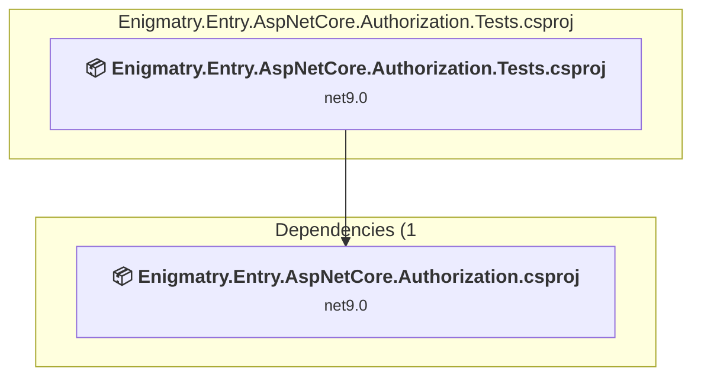
```mermaid
flowchart TB
    subgraph current["Enigmatry.Entry.AspNetCore.Authorization.Tests.csproj"]
        MAIN["<b>📦&nbsp;Enigmatry.Entry.AspNetCore.Authorization.Tests.csproj</b><br/><small>net9.0</small>"]
        click MAIN "#enigmatryentryaspnetcoreauthorizationtestsenigmatryentryaspnetcoreauthorizationtestscsproj"
    end
    subgraph downstream["Dependencies (1"]
        P31["<b>📦&nbsp;Enigmatry.Entry.AspNetCore.Authorization.csproj</b><br/><small>net9.0</small>"]
        click P31 "#enigmatryentryaspnetcoreauthorizationenigmatryentryaspnetcoreauthorizationcsproj"
    end
    MAIN --> P31

```

### API Compatibility

| Category | Count | Impact |
| :--- | :---: | :--- |
| 🔴 Binary Incompatible | 0 | High - Require code changes |
| 🟡 Source Incompatible | 0 | Medium - Needs re-compilation and potential conflicting API error fixing |
| 🔵 Behavioral change | 0 | Low - Behavioral changes that may require testing at runtime |
| ✅ Compatible | 103 |  |
| ***Total APIs Analyzed*** | ***103*** |  |

### Enigmatry.Entry.AspNetCore.Authorization\Enigmatry.Entry.AspNetCore.Authorization.csproj

#### Project Info

- **Current Target Framework:** net9.0
- **Proposed Target Framework:** net10.0
- **SDK-style**: True
- **Project Kind:** ClassLibrary
- **Dependencies**: 1
- **Dependants**: 2
- **Number of Files**: 8
- **Number of Files with Incidents**: 1
- **Lines of Code**: 238
- **Estimated LOC to modify**: 0+ (at least 0,0% of the project)

#### Dependency Graph

Legend:
📦 SDK-style project
⚙️ Classic project

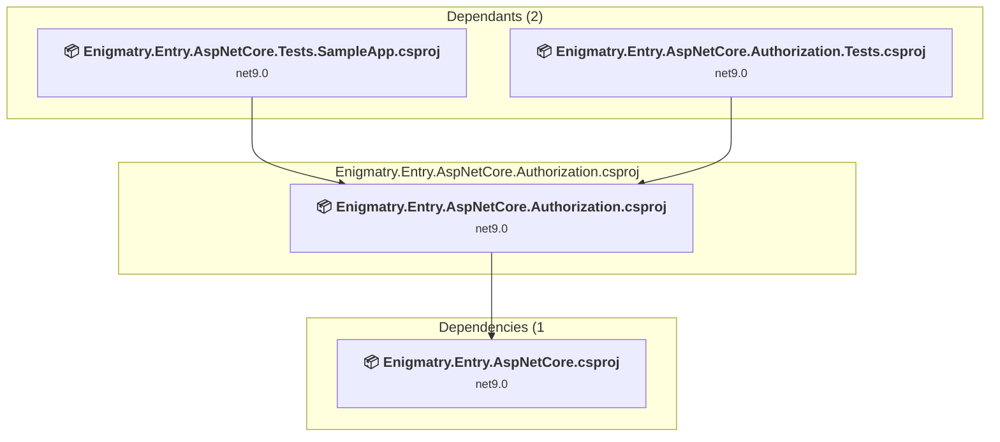
```mermaid
flowchart TB
    subgraph upstream["Dependants (2)"]
        P27["<b>📦&nbsp;Enigmatry.Entry.AspNetCore.Tests.SampleApp.csproj</b><br/><small>net9.0</small>"]
        P32["<b>📦&nbsp;Enigmatry.Entry.AspNetCore.Authorization.Tests.csproj</b><br/><small>net9.0</small>"]
        click P27 "#enigmatryentryaspnetcoretestssampleappenigmatryentryaspnetcoretestssampleappcsproj"
        click P32 "#enigmatryentryaspnetcoreauthorizationtestsenigmatryentryaspnetcoreauthorizationtestscsproj"
    end
    subgraph current["Enigmatry.Entry.AspNetCore.Authorization.csproj"]
        MAIN["<b>📦&nbsp;Enigmatry.Entry.AspNetCore.Authorization.csproj</b><br/><small>net9.0</small>"]
        click MAIN "#enigmatryentryaspnetcoreauthorizationenigmatryentryaspnetcoreauthorizationcsproj"
    end
    subgraph downstream["Dependencies (1"]
        P7["<b>📦&nbsp;Enigmatry.Entry.AspNetCore.csproj</b><br/><small>net9.0</small>"]
        click P7 "#enigmatryentryaspnetcoreenigmatryentryaspnetcorecsproj"
    end
    P27 --> MAIN
    P32 --> MAIN
    MAIN --> P7

```

### API Compatibility

| Category | Count | Impact |
| :--- | :---: | :--- |
| 🔴 Binary Incompatible | 0 | High - Require code changes |
| 🟡 Source Incompatible | 0 | Medium - Needs re-compilation and potential conflicting API error fixing |
| 🔵 Behavioral change | 0 | Low - Behavioral changes that may require testing at runtime |
| ✅ Compatible | 216 |  |
| ***Total APIs Analyzed*** | ***216*** |  |

### Enigmatry.Entry.AspNetCore.Tests.NewtonsoftJson.Tests\Enigmatry.Entry.AspNetCore.Tests.NewtonsoftJson.Tests.csproj

#### Project Info

- **Current Target Framework:** net9.0
- **Proposed Target Framework:** net10.0
- **SDK-style**: True
- **Project Kind:** DotNetCoreApp
- **Dependencies**: 2
- **Dependants**: 0
- **Number of Files**: 3
- **Number of Files with Incidents**: 1
- **Lines of Code**: 18
- **Estimated LOC to modify**: 0+ (at least 0,0% of the project)

#### Dependency Graph

Legend:
📦 SDK-style project
⚙️ Classic project

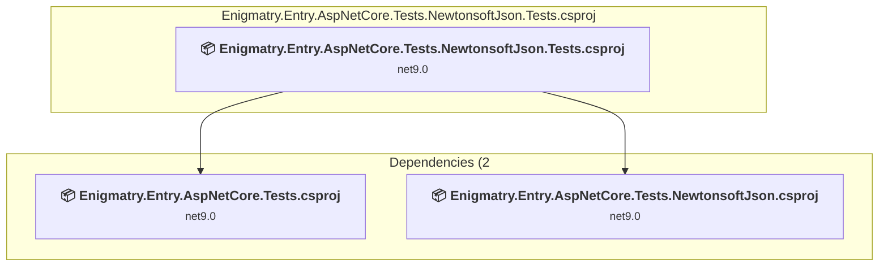
```mermaid
flowchart TB
    subgraph current["Enigmatry.Entry.AspNetCore.Tests.NewtonsoftJson.Tests.csproj"]
        MAIN["<b>📦&nbsp;Enigmatry.Entry.AspNetCore.Tests.NewtonsoftJson.Tests.csproj</b><br/><small>net9.0</small>"]
        click MAIN "#enigmatryentryaspnetcoretestsnewtonsoftjsontestsenigmatryentryaspnetcoretestsnewtonsoftjsontestscsproj"
    end
    subgraph downstream["Dependencies (2"]
        P11["<b>📦&nbsp;Enigmatry.Entry.AspNetCore.Tests.csproj</b><br/><small>net9.0</small>"]
        P14["<b>📦&nbsp;Enigmatry.Entry.AspNetCore.Tests.NewtonsoftJson.csproj</b><br/><small>net9.0</small>"]
        click P11 "#enigmatryentryaspnetcoretestsenigmatryentryaspnetcoretestscsproj"
        click P14 "#enigmatryentryaspnetcoretestsnewtonsoftjsonenigmatryentryaspnetcoretestsnewtonsoftjsoncsproj"
    end
    MAIN --> P11
    MAIN --> P14

```

### API Compatibility

| Category | Count | Impact |
| :--- | :---: | :--- |
| 🔴 Binary Incompatible | 0 | High - Require code changes |
| 🟡 Source Incompatible | 0 | Medium - Needs re-compilation and potential conflicting API error fixing |
| 🔵 Behavioral change | 0 | Low - Behavioral changes that may require testing at runtime |
| ✅ Compatible | 14 |  |
| ***Total APIs Analyzed*** | ***14*** |  |

### Enigmatry.Entry.AspNetCore.Tests.NewtonsoftJson\Enigmatry.Entry.AspNetCore.Tests.NewtonsoftJson.csproj

#### Project Info

- **Current Target Framework:** net9.0
- **Proposed Target Framework:** net10.0
- **SDK-style**: True
- **Project Kind:** ClassLibrary
- **Dependencies**: 1
- **Dependants**: 1
- **Number of Files**: 5
- **Number of Files with Incidents**: 4
- **Lines of Code**: 172
- **Estimated LOC to modify**: 24+ (at least 14,0% of the project)

#### Dependency Graph

Legend:
📦 SDK-style project
⚙️ Classic project

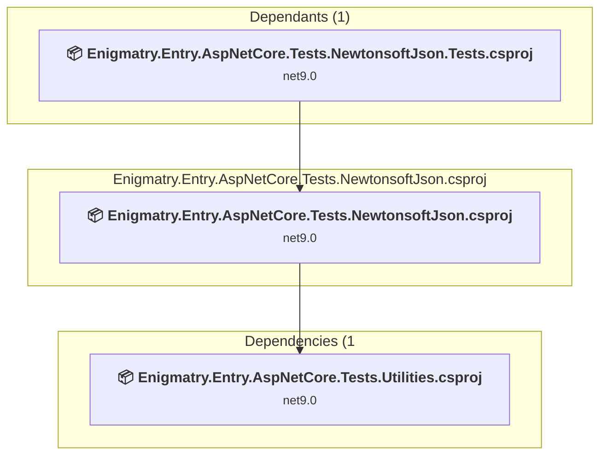
```mermaid
flowchart TB
    subgraph upstream["Dependants (1)"]
        P28["<b>📦&nbsp;Enigmatry.Entry.AspNetCore.Tests.NewtonsoftJson.Tests.csproj</b><br/><small>net9.0</small>"]
        click P28 "#enigmatryentryaspnetcoretestsnewtonsoftjsontestsenigmatryentryaspnetcoretestsnewtonsoftjsontestscsproj"
    end
    subgraph current["Enigmatry.Entry.AspNetCore.Tests.NewtonsoftJson.csproj"]
        MAIN["<b>📦&nbsp;Enigmatry.Entry.AspNetCore.Tests.NewtonsoftJson.csproj</b><br/><small>net9.0</small>"]
        click MAIN "#enigmatryentryaspnetcoretestsnewtonsoftjsonenigmatryentryaspnetcoretestsnewtonsoftjsoncsproj"
    end
    subgraph downstream["Dependencies (1"]
        P26["<b>📦&nbsp;Enigmatry.Entry.AspNetCore.Tests.Utilities.csproj</b><br/><small>net9.0</small>"]
        click P26 "#enigmatryentryaspnetcoretestsutilitiesenigmatryentryaspnetcoretestsutilitiescsproj"
    end
    P28 --> MAIN
    MAIN --> P26

```

### API Compatibility

| Category | Count | Impact |
| :--- | :---: | :--- |
| 🔴 Binary Incompatible | 0 | High - Require code changes |
| 🟡 Source Incompatible | 16 | Medium - Needs re-compilation and potential conflicting API error fixing |
| 🔵 Behavioral change | 8 | Low - Behavioral changes that may require testing at runtime |
| ✅ Compatible | 157 |  |
| ***Total APIs Analyzed*** | ***181*** |  |

### Enigmatry.Entry.AspNetCore.Tests.SampleApp\Enigmatry.Entry.AspNetCore.Tests.SampleApp.csproj

#### Project Info

- **Current Target Framework:** net9.0
- **Proposed Target Framework:** net10.0
- **SDK-style**: True
- **Project Kind:** AspNetCore
- **Dependencies**: 4
- **Dependants**: 1
- **Number of Files**: 10
- **Number of Files with Incidents**: 1
- **Lines of Code**: 175
- **Estimated LOC to modify**: 0+ (at least 0,0% of the project)

#### Dependency Graph

Legend:
📦 SDK-style project
⚙️ Classic project

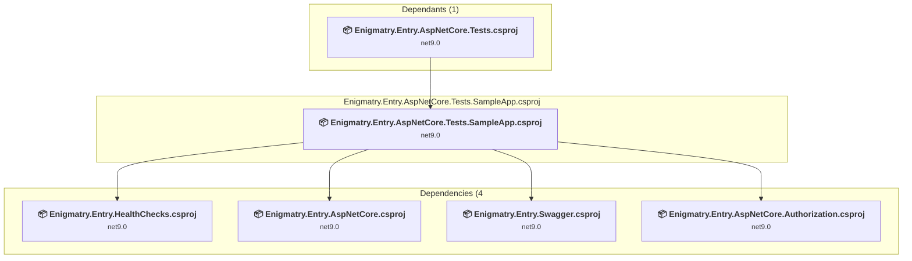
```mermaid
flowchart TB
    subgraph upstream["Dependants (1)"]
        P11["<b>📦&nbsp;Enigmatry.Entry.AspNetCore.Tests.csproj</b><br/><small>net9.0</small>"]
        click P11 "#enigmatryentryaspnetcoretestsenigmatryentryaspnetcoretestscsproj"
    end
    subgraph current["Enigmatry.Entry.AspNetCore.Tests.SampleApp.csproj"]
        MAIN["<b>📦&nbsp;Enigmatry.Entry.AspNetCore.Tests.SampleApp.csproj</b><br/><small>net9.0</small>"]
        click MAIN "#enigmatryentryaspnetcoretestssampleappenigmatryentryaspnetcoretestssampleappcsproj"
    end
    subgraph downstream["Dependencies (4"]
        P13["<b>📦&nbsp;Enigmatry.Entry.HealthChecks.csproj</b><br/><small>net9.0</small>"]
        P7["<b>📦&nbsp;Enigmatry.Entry.AspNetCore.csproj</b><br/><small>net9.0</small>"]
        P6["<b>📦&nbsp;Enigmatry.Entry.Swagger.csproj</b><br/><small>net9.0</small>"]
        P31["<b>📦&nbsp;Enigmatry.Entry.AspNetCore.Authorization.csproj</b><br/><small>net9.0</small>"]
        click P13 "#enigmatryentryhealthchecksenigmatryentryhealthcheckscsproj"
        click P7 "#enigmatryentryaspnetcoreenigmatryentryaspnetcorecsproj"
        click P6 "#enigmatryentryswaggersecurityenigmatryentryswaggercsproj"
        click P31 "#enigmatryentryaspnetcoreauthorizationenigmatryentryaspnetcoreauthorizationcsproj"
    end
    P11 --> MAIN
    MAIN --> P13
    MAIN --> P7
    MAIN --> P6
    MAIN --> P31

```

### API Compatibility

| Category | Count | Impact |
| :--- | :---: | :--- |
| 🔴 Binary Incompatible | 0 | High - Require code changes |
| 🟡 Source Incompatible | 0 | Medium - Needs re-compilation and potential conflicting API error fixing |
| 🔵 Behavioral change | 0 | Low - Behavioral changes that may require testing at runtime |
| ✅ Compatible | 173 |  |
| ***Total APIs Analyzed*** | ***173*** |  |

### Enigmatry.Entry.AspNetCore.Tests.SystemTextJson.Tests\Enigmatry.Entry.AspNetCore.Tests.SystemTextJson.Tests.csproj

#### Project Info

- **Current Target Framework:** net9.0
- **Proposed Target Framework:** net10.0
- **SDK-style**: True
- **Project Kind:** DotNetCoreApp
- **Dependencies**: 2
- **Dependants**: 0
- **Number of Files**: 3
- **Number of Files with Incidents**: 1
- **Lines of Code**: 13
- **Estimated LOC to modify**: 0+ (at least 0,0% of the project)

#### Dependency Graph

Legend:
📦 SDK-style project
⚙️ Classic project

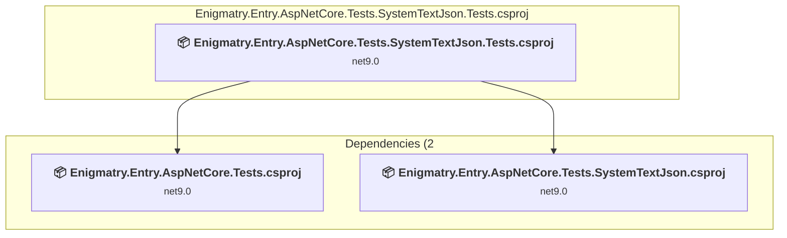
```mermaid
flowchart TB
    subgraph current["Enigmatry.Entry.AspNetCore.Tests.SystemTextJson.Tests.csproj"]
        MAIN["<b>📦&nbsp;Enigmatry.Entry.AspNetCore.Tests.SystemTextJson.Tests.csproj</b><br/><small>net9.0</small>"]
        click MAIN "#enigmatryentryaspnetcoretestssystemtextjsontestsenigmatryentryaspnetcoretestssystemtextjsontestscsproj"
    end
    subgraph downstream["Dependencies (2"]
        P11["<b>📦&nbsp;Enigmatry.Entry.AspNetCore.Tests.csproj</b><br/><small>net9.0</small>"]
        P15["<b>📦&nbsp;Enigmatry.Entry.AspNetCore.Tests.SystemTextJson.csproj</b><br/><small>net9.0</small>"]
        click P11 "#enigmatryentryaspnetcoretestsenigmatryentryaspnetcoretestscsproj"
        click P15 "#enigmatryentryaspnetcoretestssystemtextjsonenigmatryentryaspnetcoretestssystemtextjsoncsproj"
    end
    MAIN --> P11
    MAIN --> P15

```

### API Compatibility

| Category | Count | Impact |
| :--- | :---: | :--- |
| 🔴 Binary Incompatible | 0 | High - Require code changes |
| 🟡 Source Incompatible | 0 | Medium - Needs re-compilation and potential conflicting API error fixing |
| 🔵 Behavioral change | 0 | Low - Behavioral changes that may require testing at runtime |
| ✅ Compatible | 8 |  |
| ***Total APIs Analyzed*** | ***8*** |  |

### Enigmatry.Entry.AspNetCore.Tests.SystemTextJson\Enigmatry.Entry.AspNetCore.Tests.SystemTextJson.csproj

#### Project Info

- **Current Target Framework:** net9.0
- **Proposed Target Framework:** net10.0
- **SDK-style**: True
- **Project Kind:** ClassLibrary
- **Dependencies**: 1
- **Dependants**: 1
- **Number of Files**: 5
- **Number of Files with Incidents**: 4
- **Lines of Code**: 174
- **Estimated LOC to modify**: 8+ (at least 4,6% of the project)

#### Dependency Graph

Legend:
📦 SDK-style project
⚙️ Classic project

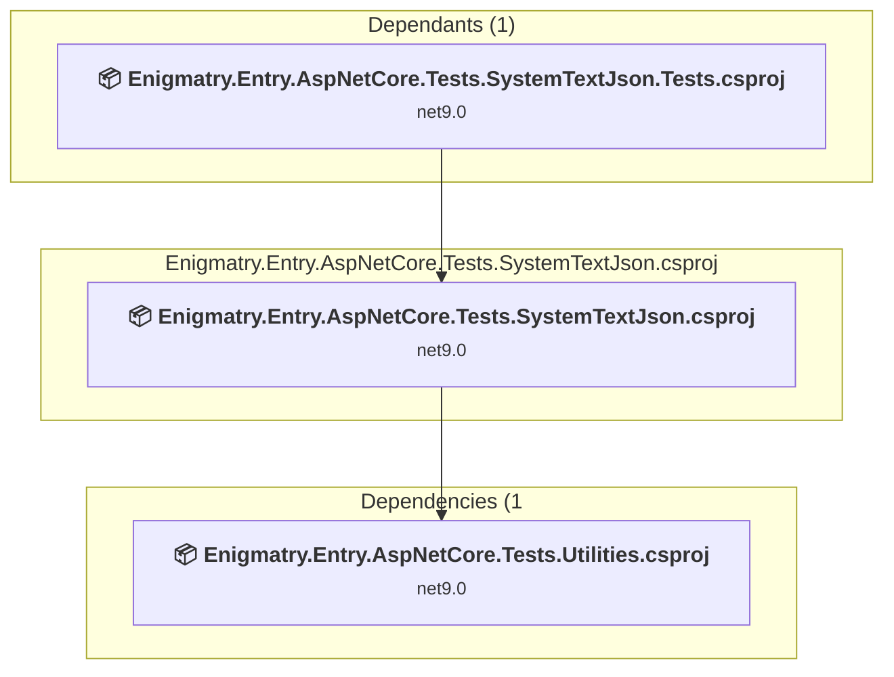
```mermaid
flowchart TB
    subgraph upstream["Dependants (1)"]
        P29["<b>📦&nbsp;Enigmatry.Entry.AspNetCore.Tests.SystemTextJson.Tests.csproj</b><br/><small>net9.0</small>"]
        click P29 "#enigmatryentryaspnetcoretestssystemtextjsontestsenigmatryentryaspnetcoretestssystemtextjsontestscsproj"
    end
    subgraph current["Enigmatry.Entry.AspNetCore.Tests.SystemTextJson.csproj"]
        MAIN["<b>📦&nbsp;Enigmatry.Entry.AspNetCore.Tests.SystemTextJson.csproj</b><br/><small>net9.0</small>"]
        click MAIN "#enigmatryentryaspnetcoretestssystemtextjsonenigmatryentryaspnetcoretestssystemtextjsoncsproj"
    end
    subgraph downstream["Dependencies (1"]
        P26["<b>📦&nbsp;Enigmatry.Entry.AspNetCore.Tests.Utilities.csproj</b><br/><small>net9.0</small>"]
        click P26 "#enigmatryentryaspnetcoretestsutilitiesenigmatryentryaspnetcoretestsutilitiescsproj"
    end
    P29 --> MAIN
    MAIN --> P26

```

### API Compatibility

| Category | Count | Impact |
| :--- | :---: | :--- |
| 🔴 Binary Incompatible | 0 | High - Require code changes |
| 🟡 Source Incompatible | 0 | Medium - Needs re-compilation and potential conflicting API error fixing |
| 🔵 Behavioral change | 8 | Low - Behavioral changes that may require testing at runtime |
| ✅ Compatible | 168 |  |
| ***Total APIs Analyzed*** | ***176*** |  |

### Enigmatry.Entry.AspNetCore.Tests.Utilities\Enigmatry.Entry.AspNetCore.Tests.Utilities.csproj

#### Project Info

- **Current Target Framework:** net9.0
- **Proposed Target Framework:** net10.0
- **SDK-style**: True
- **Project Kind:** ClassLibrary
- **Dependencies**: 1
- **Dependants**: 2
- **Number of Files**: 5
- **Number of Files with Incidents**: 2
- **Lines of Code**: 69
- **Estimated LOC to modify**: 6+ (at least 8,7% of the project)

#### Dependency Graph

Legend:
📦 SDK-style project
⚙️ Classic project

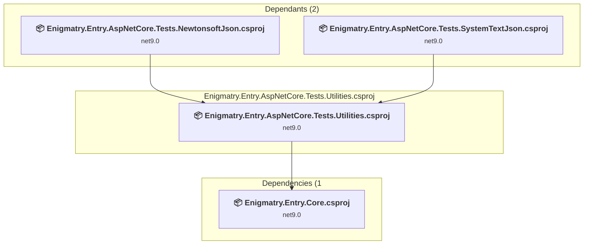
```mermaid
flowchart TB
    subgraph upstream["Dependants (2)"]
        P14["<b>📦&nbsp;Enigmatry.Entry.AspNetCore.Tests.NewtonsoftJson.csproj</b><br/><small>net9.0</small>"]
        P15["<b>📦&nbsp;Enigmatry.Entry.AspNetCore.Tests.SystemTextJson.csproj</b><br/><small>net9.0</small>"]
        click P14 "#enigmatryentryaspnetcoretestsnewtonsoftjsonenigmatryentryaspnetcoretestsnewtonsoftjsoncsproj"
        click P15 "#enigmatryentryaspnetcoretestssystemtextjsonenigmatryentryaspnetcoretestssystemtextjsoncsproj"
    end
    subgraph current["Enigmatry.Entry.AspNetCore.Tests.Utilities.csproj"]
        MAIN["<b>📦&nbsp;Enigmatry.Entry.AspNetCore.Tests.Utilities.csproj</b><br/><small>net9.0</small>"]
        click MAIN "#enigmatryentryaspnetcoretestsutilitiesenigmatryentryaspnetcoretestsutilitiescsproj"
    end
    subgraph downstream["Dependencies (1"]
        P5["<b>📦&nbsp;Enigmatry.Entry.Core.csproj</b><br/><small>net9.0</small>"]
        click P5 "#enigmatryentrycoreenigmatryentrycorecsproj"
    end
    P14 --> MAIN
    P15 --> MAIN
    MAIN --> P5

```

### API Compatibility

| Category | Count | Impact |
| :--- | :---: | :--- |
| 🔴 Binary Incompatible | 0 | High - Require code changes |
| 🟡 Source Incompatible | 0 | Medium - Needs re-compilation and potential conflicting API error fixing |
| 🔵 Behavioral change | 6 | Low - Behavioral changes that may require testing at runtime |
| ✅ Compatible | 66 |  |
| ***Total APIs Analyzed*** | ***72*** |  |

### Enigmatry.Entry.AspNetCore.Tests\Enigmatry.Entry.AspNetCore.Tests.csproj

#### Project Info

- **Current Target Framework:** net9.0
- **Proposed Target Framework:** net10.0
- **SDK-style**: True
- **Project Kind:** DotNetCoreApp
- **Dependencies**: 2
- **Dependants**: 2
- **Number of Files**: 13
- **Number of Files with Incidents**: 2
- **Lines of Code**: 665
- **Estimated LOC to modify**: 5+ (at least 0,8% of the project)

#### Dependency Graph

Legend:
📦 SDK-style project
⚙️ Classic project

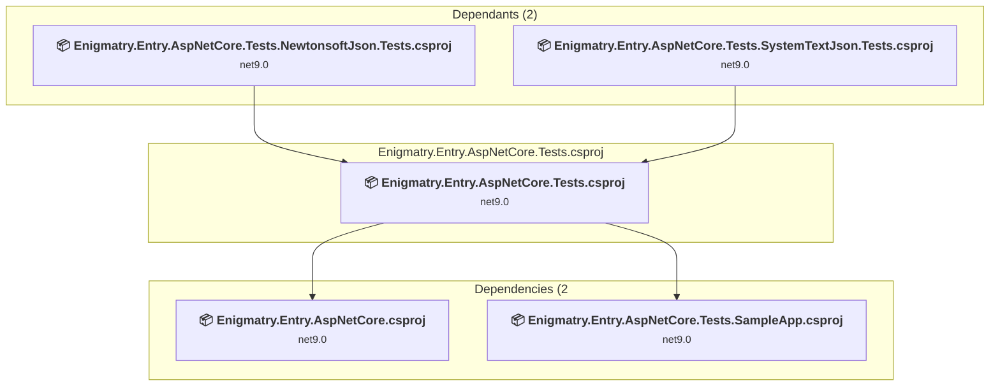
```mermaid
flowchart TB
    subgraph upstream["Dependants (2)"]
        P28["<b>📦&nbsp;Enigmatry.Entry.AspNetCore.Tests.NewtonsoftJson.Tests.csproj</b><br/><small>net9.0</small>"]
        P29["<b>📦&nbsp;Enigmatry.Entry.AspNetCore.Tests.SystemTextJson.Tests.csproj</b><br/><small>net9.0</small>"]
        click P28 "#enigmatryentryaspnetcoretestsnewtonsoftjsontestsenigmatryentryaspnetcoretestsnewtonsoftjsontestscsproj"
        click P29 "#enigmatryentryaspnetcoretestssystemtextjsontestsenigmatryentryaspnetcoretestssystemtextjsontestscsproj"
    end
    subgraph current["Enigmatry.Entry.AspNetCore.Tests.csproj"]
        MAIN["<b>📦&nbsp;Enigmatry.Entry.AspNetCore.Tests.csproj</b><br/><small>net9.0</small>"]
        click MAIN "#enigmatryentryaspnetcoretestsenigmatryentryaspnetcoretestscsproj"
    end
    subgraph downstream["Dependencies (2"]
        P7["<b>📦&nbsp;Enigmatry.Entry.AspNetCore.csproj</b><br/><small>net9.0</small>"]
        P27["<b>📦&nbsp;Enigmatry.Entry.AspNetCore.Tests.SampleApp.csproj</b><br/><small>net9.0</small>"]
        click P7 "#enigmatryentryaspnetcoreenigmatryentryaspnetcorecsproj"
        click P27 "#enigmatryentryaspnetcoretestssampleappenigmatryentryaspnetcoretestssampleappcsproj"
    end
    P28 --> MAIN
    P29 --> MAIN
    MAIN --> P7
    MAIN --> P27

```

### API Compatibility

| Category | Count | Impact |
| :--- | :---: | :--- |
| 🔴 Binary Incompatible | 0 | High - Require code changes |
| 🟡 Source Incompatible | 0 | Medium - Needs re-compilation and potential conflicting API error fixing |
| 🔵 Behavioral change | 5 | Low - Behavioral changes that may require testing at runtime |
| ✅ Compatible | 819 |  |
| ***Total APIs Analyzed*** | ***824*** |  |

### Enigmatry.Entry.AspNetCore\Enigmatry.Entry.AspNetCore.csproj

#### Project Info

- **Current Target Framework:** net9.0
- **Proposed Target Framework:** net10.0
- **SDK-style**: True
- **Project Kind:** ClassLibrary
- **Dependencies**: 1
- **Dependants**: 3
- **Number of Files**: 12
- **Number of Files with Incidents**: 3
- **Lines of Code**: 486
- **Estimated LOC to modify**: 2+ (at least 0,4% of the project)

#### Dependency Graph

Legend:
📦 SDK-style project
⚙️ Classic project

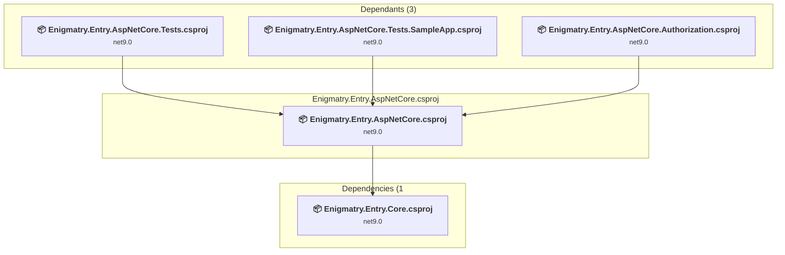
```mermaid
flowchart TB
    subgraph upstream["Dependants (3)"]
        P11["<b>📦&nbsp;Enigmatry.Entry.AspNetCore.Tests.csproj</b><br/><small>net9.0</small>"]
        P27["<b>📦&nbsp;Enigmatry.Entry.AspNetCore.Tests.SampleApp.csproj</b><br/><small>net9.0</small>"]
        P31["<b>📦&nbsp;Enigmatry.Entry.AspNetCore.Authorization.csproj</b><br/><small>net9.0</small>"]
        click P11 "#enigmatryentryaspnetcoretestsenigmatryentryaspnetcoretestscsproj"
        click P27 "#enigmatryentryaspnetcoretestssampleappenigmatryentryaspnetcoretestssampleappcsproj"
        click P31 "#enigmatryentryaspnetcoreauthorizationenigmatryentryaspnetcoreauthorizationcsproj"
    end
    subgraph current["Enigmatry.Entry.AspNetCore.csproj"]
        MAIN["<b>📦&nbsp;Enigmatry.Entry.AspNetCore.csproj</b><br/><small>net9.0</small>"]
        click MAIN "#enigmatryentryaspnetcoreenigmatryentryaspnetcorecsproj"
    end
    subgraph downstream["Dependencies (1"]
        P5["<b>📦&nbsp;Enigmatry.Entry.Core.csproj</b><br/><small>net9.0</small>"]
        click P5 "#enigmatryentrycoreenigmatryentrycorecsproj"
    end
    P11 --> MAIN
    P27 --> MAIN
    P31 --> MAIN
    MAIN --> P5

```

### API Compatibility

| Category | Count | Impact |
| :--- | :---: | :--- |
| 🔴 Binary Incompatible | 0 | High - Require code changes |
| 🟡 Source Incompatible | 1 | Medium - Needs re-compilation and potential conflicting API error fixing |
| 🔵 Behavioral change | 1 | Low - Behavioral changes that may require testing at runtime |
| ✅ Compatible | 477 |  |
| ***Total APIs Analyzed*** | ***479*** |  |

### Enigmatry.Entry.AzureSearch.Tests\Enigmatry.Entry.AzureSearch.Tests.csproj

#### Project Info

- **Current Target Framework:** net9.0
- **Proposed Target Framework:** net10.0
- **SDK-style**: True
- **Project Kind:** DotNetCoreApp
- **Dependencies**: 1
- **Dependants**: 0
- **Number of Files**: 23
- **Number of Files with Incidents**: 3
- **Lines of Code**: 1003
- **Estimated LOC to modify**: 5+ (at least 0,5% of the project)

#### Dependency Graph

Legend:
📦 SDK-style project
⚙️ Classic project

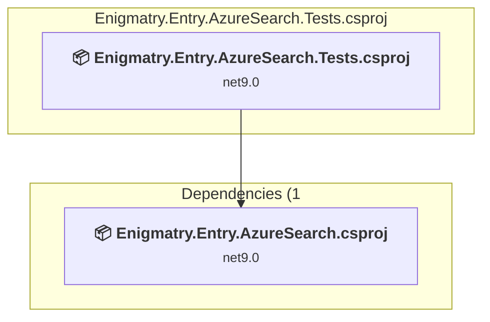
```mermaid
flowchart TB
    subgraph current["Enigmatry.Entry.AzureSearch.Tests.csproj"]
        MAIN["<b>📦&nbsp;Enigmatry.Entry.AzureSearch.Tests.csproj</b><br/><small>net9.0</small>"]
        click MAIN "#enigmatryentryazuresearchtestsenigmatryentryazuresearchtestscsproj"
    end
    subgraph downstream["Dependencies (1"]
        P33["<b>📦&nbsp;Enigmatry.Entry.AzureSearch.csproj</b><br/><small>net9.0</small>"]
        click P33 "#enigmatryentryazuresearchenigmatryentryazuresearchcsproj"
    end
    MAIN --> P33

```

### API Compatibility

| Category | Count | Impact |
| :--- | :---: | :--- |
| 🔴 Binary Incompatible | 0 | High - Require code changes |
| 🟡 Source Incompatible | 1 | Medium - Needs re-compilation and potential conflicting API error fixing |
| 🔵 Behavioral change | 4 | Low - Behavioral changes that may require testing at runtime |
| ✅ Compatible | 1044 |  |
| ***Total APIs Analyzed*** | ***1049*** |  |

### Enigmatry.Entry.AzureSearch\Enigmatry.Entry.AzureSearch.csproj

#### Project Info

- **Current Target Framework:** net9.0
- **Proposed Target Framework:** net10.0
- **SDK-style**: True
- **Project Kind:** ClassLibrary
- **Dependencies**: 1
- **Dependants**: 1
- **Number of Files**: 25
- **Number of Files with Incidents**: 4
- **Lines of Code**: 702
- **Estimated LOC to modify**: 8+ (at least 1,1% of the project)

#### Dependency Graph

Legend:
📦 SDK-style project
⚙️ Classic project

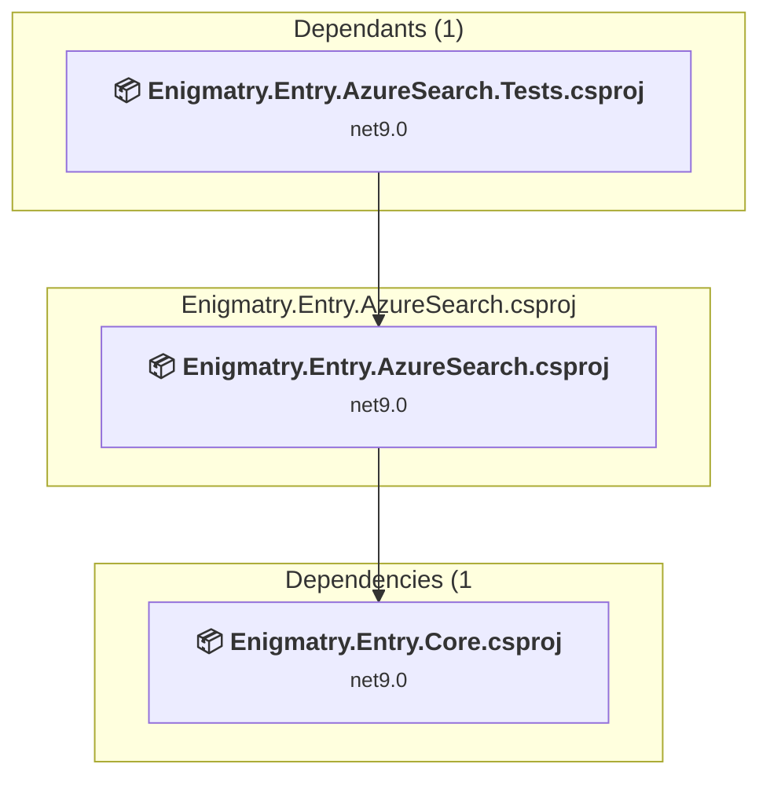
```mermaid
flowchart TB
    subgraph upstream["Dependants (1)"]
        P34["<b>📦&nbsp;Enigmatry.Entry.AzureSearch.Tests.csproj</b><br/><small>net9.0</small>"]
        click P34 "#enigmatryentryazuresearchtestsenigmatryentryazuresearchtestscsproj"
    end
    subgraph current["Enigmatry.Entry.AzureSearch.csproj"]
        MAIN["<b>📦&nbsp;Enigmatry.Entry.AzureSearch.csproj</b><br/><small>net9.0</small>"]
        click MAIN "#enigmatryentryazuresearchenigmatryentryazuresearchcsproj"
    end
    subgraph downstream["Dependencies (1"]
        P5["<b>📦&nbsp;Enigmatry.Entry.Core.csproj</b><br/><small>net9.0</small>"]
        click P5 "#enigmatryentrycoreenigmatryentrycorecsproj"
    end
    P34 --> MAIN
    MAIN --> P5

```

### API Compatibility

| Category | Count | Impact |
| :--- | :---: | :--- |
| 🔴 Binary Incompatible | 1 | High - Require code changes |
| 🟡 Source Incompatible | 0 | Medium - Needs re-compilation and potential conflicting API error fixing |
| 🔵 Behavioral change | 7 | Low - Behavioral changes that may require testing at runtime |
| ✅ Compatible | 640 |  |
| ***Total APIs Analyzed*** | ***648*** |  |

### Enigmatry.Entry.BlobStorage.Tests\Enigmatry.Entry.BlobStorage.Tests.csproj

#### Project Info

- **Current Target Framework:** net9.0
- **Proposed Target Framework:** net10.0
- **SDK-style**: True
- **Project Kind:** DotNetCoreApp
- **Dependencies**: 1
- **Dependants**: 0
- **Number of Files**: 4
- **Number of Files with Incidents**: 3
- **Lines of Code**: 199
- **Estimated LOC to modify**: 18+ (at least 9,0% of the project)

#### Dependency Graph

Legend:
📦 SDK-style project
⚙️ Classic project

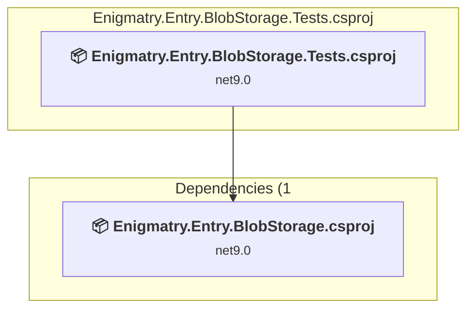
```mermaid
flowchart TB
    subgraph current["Enigmatry.Entry.BlobStorage.Tests.csproj"]
        MAIN["<b>📦&nbsp;Enigmatry.Entry.BlobStorage.Tests.csproj</b><br/><small>net9.0</small>"]
        click MAIN "#enigmatryentryblobstoragetestsenigmatryentryblobstoragetestscsproj"
    end
    subgraph downstream["Dependencies (1"]
        P4["<b>📦&nbsp;Enigmatry.Entry.BlobStorage.csproj</b><br/><small>net9.0</small>"]
        click P4 "#enigmatryentryblobstorageenigmatryentryblobstoragecsproj"
    end
    MAIN --> P4

```

### API Compatibility

| Category | Count | Impact |
| :--- | :---: | :--- |
| 🔴 Binary Incompatible | 0 | High - Require code changes |
| 🟡 Source Incompatible | 0 | Medium - Needs re-compilation and potential conflicting API error fixing |
| 🔵 Behavioral change | 18 | Low - Behavioral changes that may require testing at runtime |
| ✅ Compatible | 237 |  |
| ***Total APIs Analyzed*** | ***255*** |  |

### Enigmatry.Entry.BlobStorage\Enigmatry.Entry.BlobStorage.csproj

#### Project Info

- **Current Target Framework:** net9.0
- **Proposed Target Framework:** net10.0
- **SDK-style**: True
- **Project Kind:** ClassLibrary
- **Dependencies**: 1
- **Dependants**: 1
- **Number of Files**: 16
- **Number of Files with Incidents**: 7
- **Lines of Code**: 558
- **Estimated LOC to modify**: 11+ (at least 2,0% of the project)

#### Dependency Graph

Legend:
📦 SDK-style project
⚙️ Classic project

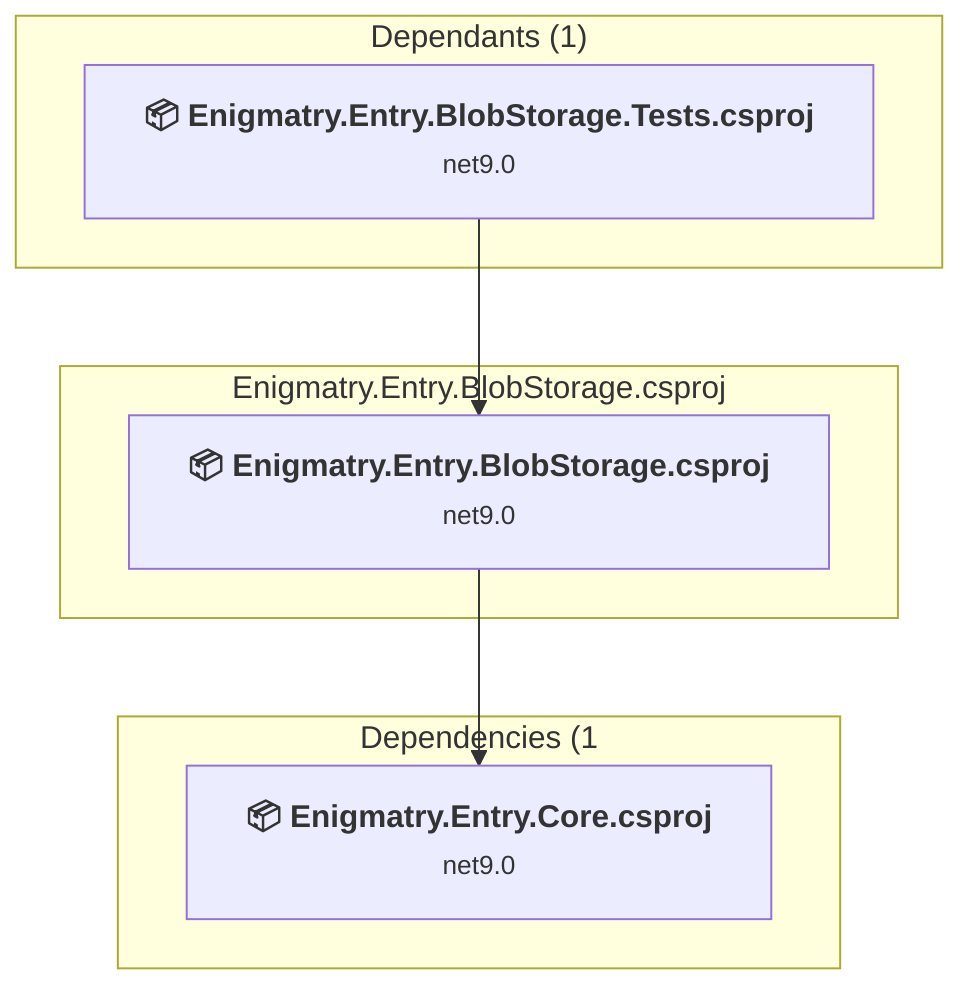
```mermaid
flowchart TB
    subgraph upstream["Dependants (1)"]
        P18["<b>📦&nbsp;Enigmatry.Entry.BlobStorage.Tests.csproj</b><br/><small>net9.0</small>"]
        click P18 "#enigmatryentryblobstoragetestsenigmatryentryblobstoragetestscsproj"
    end
    subgraph current["Enigmatry.Entry.BlobStorage.csproj"]
        MAIN["<b>📦&nbsp;Enigmatry.Entry.BlobStorage.csproj</b><br/><small>net9.0</small>"]
        click MAIN "#enigmatryentryblobstorageenigmatryentryblobstoragecsproj"
    end
    subgraph downstream["Dependencies (1"]
        P5["<b>📦&nbsp;Enigmatry.Entry.Core.csproj</b><br/><small>net9.0</small>"]
        click P5 "#enigmatryentrycoreenigmatryentrycorecsproj"
    end
    P18 --> MAIN
    MAIN --> P5

```

### API Compatibility

| Category | Count | Impact |
| :--- | :---: | :--- |
| 🔴 Binary Incompatible | 1 | High - Require code changes |
| 🟡 Source Incompatible | 0 | Medium - Needs re-compilation and potential conflicting API error fixing |
| 🔵 Behavioral change | 10 | Low - Behavioral changes that may require testing at runtime |
| ✅ Compatible | 686 |  |
| ***Total APIs Analyzed*** | ***697*** |  |

### Enigmatry.Entry.Core.EntityFramework\Enigmatry.Entry.Core.EntityFramework.csproj

#### Project Info

- **Current Target Framework:** net9.0
- **Proposed Target Framework:** net10.0
- **SDK-style**: True
- **Project Kind:** ClassLibrary
- **Dependencies**: 1
- **Dependants**: 2
- **Number of Files**: 2
- **Number of Files with Incidents**: 1
- **Lines of Code**: 115
- **Estimated LOC to modify**: 0+ (at least 0,0% of the project)

#### Dependency Graph

Legend:
📦 SDK-style project
⚙️ Classic project

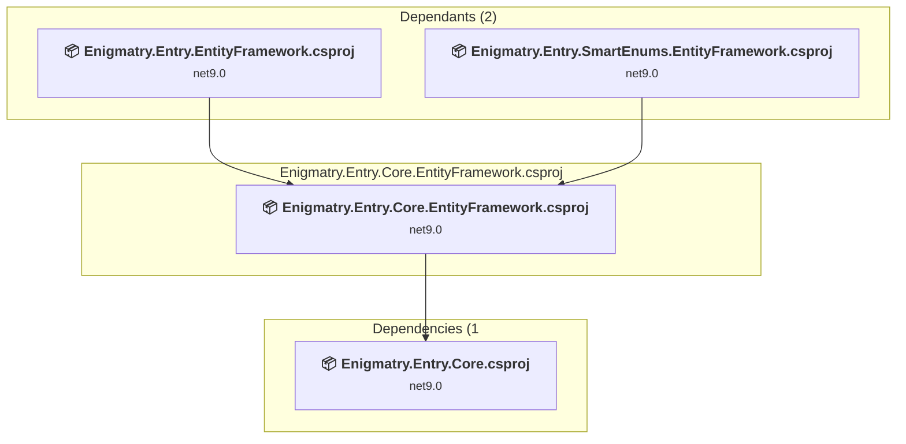
```mermaid
flowchart TB
    subgraph upstream["Dependants (2)"]
        P8["<b>📦&nbsp;Enigmatry.Entry.EntityFramework.csproj</b><br/><small>net9.0</small>"]
        P40["<b>📦&nbsp;Enigmatry.Entry.SmartEnums.EntityFramework.csproj</b><br/><small>net9.0</small>"]
        click P8 "#enigmatryentryentityframeworkenigmatryentryentityframeworkcsproj"
        click P40 "#enigmatryentrysmartenumsentityframeworkenigmatryentrysmartenumsentityframeworkcsproj"
    end
    subgraph current["Enigmatry.Entry.Core.EntityFramework.csproj"]
        MAIN["<b>📦&nbsp;Enigmatry.Entry.Core.EntityFramework.csproj</b><br/><small>net9.0</small>"]
        click MAIN "#enigmatryentrycoreentityframeworkenigmatryentrycoreentityframeworkcsproj"
    end
    subgraph downstream["Dependencies (1"]
        P5["<b>📦&nbsp;Enigmatry.Entry.Core.csproj</b><br/><small>net9.0</small>"]
        click P5 "#enigmatryentrycoreenigmatryentrycorecsproj"
    end
    P8 --> MAIN
    P40 --> MAIN
    MAIN --> P5

```

### API Compatibility

| Category | Count | Impact |
| :--- | :---: | :--- |
| 🔴 Binary Incompatible | 0 | High - Require code changes |
| 🟡 Source Incompatible | 0 | Medium - Needs re-compilation and potential conflicting API error fixing |
| 🔵 Behavioral change | 0 | Low - Behavioral changes that may require testing at runtime |
| ✅ Compatible | 107 |  |
| ***Total APIs Analyzed*** | ***107*** |  |

### Enigmatry.Entry.Core.Tests\Enigmatry.Entry.Core.Tests.csproj

#### Project Info

- **Current Target Framework:** net9.0
- **Proposed Target Framework:** net10.0
- **SDK-style**: True
- **Project Kind:** DotNetCoreApp
- **Dependencies**: 1
- **Dependants**: 0
- **Number of Files**: 5
- **Number of Files with Incidents**: 1
- **Lines of Code**: 118
- **Estimated LOC to modify**: 0+ (at least 0,0% of the project)

#### Dependency Graph

Legend:
📦 SDK-style project
⚙️ Classic project

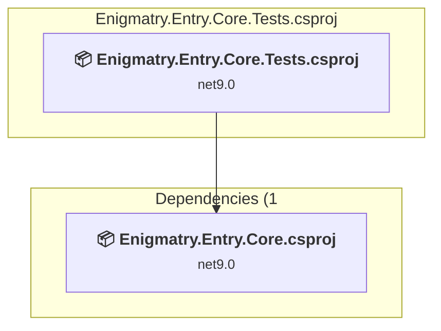
```mermaid
flowchart TB
    subgraph current["Enigmatry.Entry.Core.Tests.csproj"]
        MAIN["<b>📦&nbsp;Enigmatry.Entry.Core.Tests.csproj</b><br/><small>net9.0</small>"]
        click MAIN "#enigmatryentrycoretestsenigmatryentrycoretestscsproj"
    end
    subgraph downstream["Dependencies (1"]
        P5["<b>📦&nbsp;Enigmatry.Entry.Core.csproj</b><br/><small>net9.0</small>"]
        click P5 "#enigmatryentrycoreenigmatryentrycorecsproj"
    end
    MAIN --> P5

```

### API Compatibility

| Category | Count | Impact |
| :--- | :---: | :--- |
| 🔴 Binary Incompatible | 0 | High - Require code changes |
| 🟡 Source Incompatible | 0 | Medium - Needs re-compilation and potential conflicting API error fixing |
| 🔵 Behavioral change | 0 | Low - Behavioral changes that may require testing at runtime |
| ✅ Compatible | 99 |  |
| ***Total APIs Analyzed*** | ***99*** |  |

### Enigmatry.Entry.Core\Enigmatry.Entry.Core.csproj

#### Project Info

- **Current Target Framework:** net9.0
- **Proposed Target Framework:** net10.0
- **SDK-style**: True
- **Project Kind:** ClassLibrary
- **Dependencies**: 0
- **Dependants**: 15
- **Number of Files**: 37
- **Number of Files with Incidents**: 1
- **Lines of Code**: 1117
- **Estimated LOC to modify**: 0+ (at least 0,0% of the project)

#### Dependency Graph

Legend:
📦 SDK-style project
⚙️ Classic project

```mermaid
flowchart TB
    subgraph upstream["Dependants (15)"]
        P1["<b>📦&nbsp;Enigmatry.Entry.TemplatingEngine.Razor.csproj</b><br/><small>net9.0</small>"]
        P3["<b>📦&nbsp;Enigmatry.Entry.Email.csproj</b><br/><small>net9.0</small>"]
        P4["<b>📦&nbsp;Enigmatry.Entry.BlobStorage.csproj</b><br/><small>net9.0</small>"]
        P7["<b>📦&nbsp;Enigmatry.Entry.AspNetCore.csproj</b><br/><small>net9.0</small>"]
        P9["<b>📦&nbsp;Enigmatry.Entry.Infrastructure.csproj</b><br/><small>net9.0</small>"]
        P10["<b>📦&nbsp;Enigmatry.Entry.Core.EntityFramework.csproj</b><br/><small>net9.0</small>"]
        P13["<b>📦&nbsp;Enigmatry.Entry.HealthChecks.csproj</b><br/><small>net9.0</small>"]
        P17["<b>📦&nbsp;Enigmatry.Entry.GraphApi.csproj</b><br/><small>net9.0</small>"]
        P19["<b>📦&nbsp;Enigmatry.Entry.Core.Tests.csproj</b><br/><small>net9.0</small>"]
        P22["<b>📦&nbsp;Enigmatry.Entry.TemplatingEngine.Razor.Tests.csproj</b><br/><small>net9.0</small>"]
        P23["<b>📦&nbsp;Enigmatry.Entry.Scheduler.csproj</b><br/><small>net9.0</small>"]
        P26["<b>📦&nbsp;Enigmatry.Entry.AspNetCore.Tests.Utilities.csproj</b><br/><small>net9.0</small>"]
        P33["<b>📦&nbsp;Enigmatry.Entry.AzureSearch.csproj</b><br/><small>net9.0</small>"]
        P37["<b>📦&nbsp;Enigmatry.Entry.TemplatingEngine.Fluid.csproj</b><br/><small>net9.0</small>"]
        P39["<b>📦&nbsp;Enigmatry.Entry.SmartEnums.csproj</b><br/><small>net9.0</small>"]
        click P1 "#enigmatryentrytemplatingenginerazorenigmatryentrytemplatingenginerazorcsproj"
        click P3 "#enigmatryentryemailclientenigmatryentryemailcsproj"
        click P4 "#enigmatryentryblobstorageenigmatryentryblobstoragecsproj"
        click P7 "#enigmatryentryaspnetcoreenigmatryentryaspnetcorecsproj"
        click P9 "#enigmatryentryinfrastructureenigmatryentryinfrastructurecsproj"
        click P10 "#enigmatryentrycoreentityframeworkenigmatryentrycoreentityframeworkcsproj"
        click P13 "#enigmatryentryhealthchecksenigmatryentryhealthcheckscsproj"
        click P17 "#enigmatryentrygraphapienigmatryentrygraphapicsproj"
        click P19 "#enigmatryentrycoretestsenigmatryentrycoretestscsproj"
        click P22 "#enigmatryentrytemplatingenginerazortestsenigmatryentrytemplatingenginerazortestscsproj"
        click P23 "#enigmatryentryschedulerenigmatryentryschedulercsproj"
        click P26 "#enigmatryentryaspnetcoretestsutilitiesenigmatryentryaspnetcoretestsutilitiescsproj"
        click P33 "#enigmatryentryazuresearchenigmatryentryazuresearchcsproj"
        click P37 "#enigmatryentrytemplatingenginefluidenigmatryentrytemplatingenginefluidcsproj"
        click P39 "#enigmatryentrysmartenumsenigmatryentrysmartenumscsproj"
    end
    subgraph current["Enigmatry.Entry.Core.csproj"]
        MAIN["<b>📦&nbsp;Enigmatry.Entry.Core.csproj</b><br/><small>net9.0</small>"]
        click MAIN "#enigmatryentrycoreenigmatryentrycorecsproj"
    end
    P1 --> MAIN
    P3 --> MAIN
    P4 --> MAIN
    P7 --> MAIN
    P9 --> MAIN
    P10 --> MAIN
    P13 --> MAIN
    P17 --> MAIN
    P19 --> MAIN
    P22 --> MAIN
    P23 --> MAIN
    P26 --> MAIN
    P33 --> MAIN
    P37 --> MAIN
    P39 --> MAIN

```

### API Compatibility

| Category | Count | Impact |
| :--- | :---: | :--- |
| 🔴 Binary Incompatible | 0 | High - Require code changes |
| 🟡 Source Incompatible | 0 | Medium - Needs re-compilation and potential conflicting API error fixing |
| 🔵 Behavioral change | 0 | Low - Behavioral changes that may require testing at runtime |
| ✅ Compatible | 1086 |  |
| ***Total APIs Analyzed*** | ***1086*** |  |

### Enigmatry.Entry.Csv.Tests\Enigmatry.Entry.Csv.Tests.csproj

#### Project Info

- **Current Target Framework:** net9.0
- **Proposed Target Framework:** net10.0
- **SDK-style**: True
- **Project Kind:** DotNetCoreApp
- **Dependencies**: 1
- **Dependants**: 0
- **Number of Files**: 4
- **Number of Files with Incidents**: 1
- **Lines of Code**: 195
- **Estimated LOC to modify**: 0+ (at least 0,0% of the project)

#### Dependency Graph

Legend:
📦 SDK-style project
⚙️ Classic project

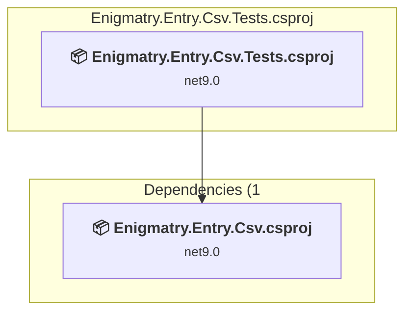
```mermaid
flowchart TB
    subgraph current["Enigmatry.Entry.Csv.Tests.csproj"]
        MAIN["<b>📦&nbsp;Enigmatry.Entry.Csv.Tests.csproj</b><br/><small>net9.0</small>"]
        click MAIN "#enigmatryentrycsvtestsenigmatryentrycsvtestscsproj"
    end
    subgraph downstream["Dependencies (1"]
        P2["<b>📦&nbsp;Enigmatry.Entry.Csv.csproj</b><br/><small>net9.0</small>"]
        click P2 "#enigmatryentrycsvenigmatryentrycsvcsproj"
    end
    MAIN --> P2

```

### API Compatibility

| Category | Count | Impact |
| :--- | :---: | :--- |
| 🔴 Binary Incompatible | 0 | High - Require code changes |
| 🟡 Source Incompatible | 0 | Medium - Needs re-compilation and potential conflicting API error fixing |
| 🔵 Behavioral change | 0 | Low - Behavioral changes that may require testing at runtime |
| ✅ Compatible | 195 |  |
| ***Total APIs Analyzed*** | ***195*** |  |

### Enigmatry.Entry.Csv\Enigmatry.Entry.Csv.csproj

#### Project Info

- **Current Target Framework:** net9.0
- **Proposed Target Framework:** net10.0
- **SDK-style**: True
- **Project Kind:** ClassLibrary
- **Dependencies**: 0
- **Dependants**: 1
- **Number of Files**: 5
- **Number of Files with Incidents**: 1
- **Lines of Code**: 186
- **Estimated LOC to modify**: 0+ (at least 0,0% of the project)

#### Dependency Graph

Legend:
📦 SDK-style project
⚙️ Classic project

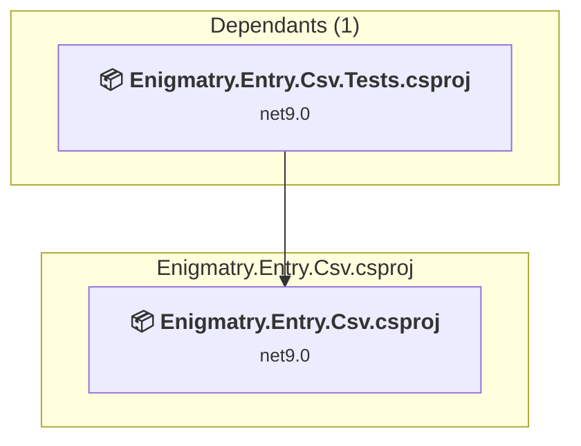
```mermaid
flowchart TB
    subgraph upstream["Dependants (1)"]
        P20["<b>📦&nbsp;Enigmatry.Entry.Csv.Tests.csproj</b><br/><small>net9.0</small>"]
        click P20 "#enigmatryentrycsvtestsenigmatryentrycsvtestscsproj"
    end
    subgraph current["Enigmatry.Entry.Csv.csproj"]
        MAIN["<b>📦&nbsp;Enigmatry.Entry.Csv.csproj</b><br/><small>net9.0</small>"]
        click MAIN "#enigmatryentrycsvenigmatryentrycsvcsproj"
    end
    P20 --> MAIN

```

### API Compatibility

| Category | Count | Impact |
| :--- | :---: | :--- |
| 🔴 Binary Incompatible | 0 | High - Require code changes |
| 🟡 Source Incompatible | 0 | Medium - Needs re-compilation and potential conflicting API error fixing |
| 🔵 Behavioral change | 0 | Low - Behavioral changes that may require testing at runtime |
| ✅ Compatible | 196 |  |
| ***Total APIs Analyzed*** | ***196*** |  |

### Enigmatry.Entry.Email.Tests\Enigmatry.Entry.Email.Tests.csproj

#### Project Info

- **Current Target Framework:** net9.0
- **Proposed Target Framework:** net10.0
- **SDK-style**: True
- **Project Kind:** DotNetCoreApp
- **Dependencies**: 1
- **Dependants**: 0
- **Number of Files**: 5
- **Number of Files with Incidents**: 1
- **Lines of Code**: 125
- **Estimated LOC to modify**: 0+ (at least 0,0% of the project)

#### Dependency Graph

Legend:
📦 SDK-style project
⚙️ Classic project

```mermaid
flowchart TB
    subgraph current["Enigmatry.Entry.Email.Tests.csproj"]
        MAIN["<b>📦&nbsp;Enigmatry.Entry.Email.Tests.csproj</b><br/><small>net9.0</small>"]
        click MAIN "#enigmatryentryemailtestsenigmatryentryemailtestscsproj"
    end
    subgraph downstream["Dependencies (1"]
        P3["<b>📦&nbsp;Enigmatry.Entry.Email.csproj</b><br/><small>net9.0</small>"]
        click P3 "#enigmatryentryemailclientenigmatryentryemailcsproj"
    end
    MAIN --> P3

```

### API Compatibility

| Category | Count | Impact |
| :--- | :---: | :--- |
| 🔴 Binary Incompatible | 0 | High - Require code changes |
| 🟡 Source Incompatible | 0 | Medium - Needs re-compilation and potential conflicting API error fixing |
| 🔵 Behavioral change | 0 | Low - Behavioral changes that may require testing at runtime |
| ✅ Compatible | 143 |  |
| ***Total APIs Analyzed*** | ***143*** |  |

### Enigmatry.Entry.EmailClient\Enigmatry.Entry.Email.csproj

#### Project Info

- **Current Target Framework:** net9.0
- **Proposed Target Framework:** net10.0
- **SDK-style**: True
- **Project Kind:** ClassLibrary
- **Dependencies**: 1
- **Dependants**: 1
- **Number of Files**: 15
- **Number of Files with Incidents**: 2
- **Lines of Code**: 632
- **Estimated LOC to modify**: 2+ (at least 0,3% of the project)

#### Dependency Graph

Legend:
📦 SDK-style project
⚙️ Classic project

```mermaid
flowchart TB
    subgraph upstream["Dependants (1)"]
        P21["<b>📦&nbsp;Enigmatry.Entry.Email.Tests.csproj</b><br/><small>net9.0</small>"]
        click P21 "#enigmatryentryemailtestsenigmatryentryemailtestscsproj"
    end
    subgraph current["Enigmatry.Entry.Email.csproj"]
        MAIN["<b>📦&nbsp;Enigmatry.Entry.Email.csproj</b><br/><small>net9.0</small>"]
        click MAIN "#enigmatryentryemailclientenigmatryentryemailcsproj"
    end
    subgraph downstream["Dependencies (1"]
        P5["<b>📦&nbsp;Enigmatry.Entry.Core.csproj</b><br/><small>net9.0</small>"]
        click P5 "#enigmatryentrycoreenigmatryentrycorecsproj"
    end
    P21 --> MAIN
    MAIN --> P5

```

### API Compatibility

| Category | Count | Impact |
| :--- | :---: | :--- |
| 🔴 Binary Incompatible | 2 | High - Require code changes |
| 🟡 Source Incompatible | 0 | Medium - Needs re-compilation and potential conflicting API error fixing |
| 🔵 Behavioral change | 0 | Low - Behavioral changes that may require testing at runtime |
| ✅ Compatible | 773 |  |
| ***Total APIs Analyzed*** | ***775*** |  |

### Enigmatry.Entry.EntityFramework.Tests\Enigmatry.Entry.EntityFramework.Tests.csproj

#### Project Info

- **Current Target Framework:** net9.0
- **Proposed Target Framework:** net10.0
- **SDK-style**: True
- **Project Kind:** DotNetCoreApp
- **Dependencies**: 1
- **Dependants**: 0
- **Number of Files**: 3
- **Number of Files with Incidents**: 1
- **Lines of Code**: 94
- **Estimated LOC to modify**: 0+ (at least 0,0% of the project)

#### Dependency Graph

Legend:
📦 SDK-style project
⚙️ Classic project

```mermaid
flowchart TB
    subgraph current["Enigmatry.Entry.EntityFramework.Tests.csproj"]
        MAIN["<b>📦&nbsp;Enigmatry.Entry.EntityFramework.Tests.csproj</b><br/><small>net9.0</small>"]
        click MAIN "#enigmatryentryentityframeworktestsenigmatryentryentityframeworktestscsproj"
    end
    subgraph downstream["Dependencies (1"]
        P8["<b>📦&nbsp;Enigmatry.Entry.EntityFramework.csproj</b><br/><small>net9.0</small>"]
        click P8 "#enigmatryentryentityframeworkenigmatryentryentityframeworkcsproj"
    end
    MAIN --> P8

```

### API Compatibility

| Category | Count | Impact |
| :--- | :---: | :--- |
| 🔴 Binary Incompatible | 0 | High - Require code changes |
| 🟡 Source Incompatible | 0 | Medium - Needs re-compilation and potential conflicting API error fixing |
| 🔵 Behavioral change | 0 | Low - Behavioral changes that may require testing at runtime |
| ✅ Compatible | 166 |  |
| ***Total APIs Analyzed*** | ***166*** |  |

### Enigmatry.Entry.EntityFramework\Enigmatry.Entry.EntityFramework.csproj

#### Project Info

- **Current Target Framework:** net9.0
- **Proposed Target Framework:** net10.0
- **SDK-style**: True
- **Project Kind:** ClassLibrary
- **Dependencies**: 1
- **Dependants**: 1
- **Number of Files**: 9
- **Number of Files with Incidents**: 1
- **Lines of Code**: 510
- **Estimated LOC to modify**: 0+ (at least 0,0% of the project)

#### Dependency Graph

Legend:
📦 SDK-style project
⚙️ Classic project

```mermaid
flowchart TB
    subgraph upstream["Dependants (1)"]
        P35["<b>📦&nbsp;Enigmatry.Entry.EntityFramework.Tests.csproj</b><br/><small>net9.0</small>"]
        click P35 "#enigmatryentryentityframeworktestsenigmatryentryentityframeworktestscsproj"
    end
    subgraph current["Enigmatry.Entry.EntityFramework.csproj"]
        MAIN["<b>📦&nbsp;Enigmatry.Entry.EntityFramework.csproj</b><br/><small>net9.0</small>"]
        click MAIN "#enigmatryentryentityframeworkenigmatryentryentityframeworkcsproj"
    end
    subgraph downstream["Dependencies (1"]
        P10["<b>📦&nbsp;Enigmatry.Entry.Core.EntityFramework.csproj</b><br/><small>net9.0</small>"]
        click P10 "#enigmatryentrycoreentityframeworkenigmatryentrycoreentityframeworkcsproj"
    end
    P35 --> MAIN
    MAIN --> P10

```

### API Compatibility

| Category | Count | Impact |
| :--- | :---: | :--- |
| 🔴 Binary Incompatible | 0 | High - Require code changes |
| 🟡 Source Incompatible | 0 | Medium - Needs re-compilation and potential conflicting API error fixing |
| 🔵 Behavioral change | 0 | Low - Behavioral changes that may require testing at runtime |
| ✅ Compatible | 494 |  |
| ***Total APIs Analyzed*** | ***494*** |  |

### Enigmatry.Entry.GraphApi\Enigmatry.Entry.GraphApi.csproj

#### Project Info

- **Current Target Framework:** net9.0
- **Proposed Target Framework:** net10.0
- **SDK-style**: True
- **Project Kind:** ClassLibrary
- **Dependencies**: 1
- **Dependants**: 0
- **Number of Files**: 11
- **Number of Files with Incidents**: 3
- **Lines of Code**: 466
- **Estimated LOC to modify**: 2+ (at least 0,4% of the project)

#### Dependency Graph

Legend:
📦 SDK-style project
⚙️ Classic project

```mermaid
flowchart TB
    subgraph current["Enigmatry.Entry.GraphApi.csproj"]
        MAIN["<b>📦&nbsp;Enigmatry.Entry.GraphApi.csproj</b><br/><small>net9.0</small>"]
        click MAIN "#enigmatryentrygraphapienigmatryentrygraphapicsproj"
    end
    subgraph downstream["Dependencies (1"]
        P5["<b>📦&nbsp;Enigmatry.Entry.Core.csproj</b><br/><small>net9.0</small>"]
        click P5 "#enigmatryentrycoreenigmatryentrycorecsproj"
    end
    MAIN --> P5

```

### API Compatibility

| Category | Count | Impact |
| :--- | :---: | :--- |
| 🔴 Binary Incompatible | 1 | High - Require code changes |
| 🟡 Source Incompatible | 0 | Medium - Needs re-compilation and potential conflicting API error fixing |
| 🔵 Behavioral change | 1 | Low - Behavioral changes that may require testing at runtime |
| ✅ Compatible | 390 |  |
| ***Total APIs Analyzed*** | ***392*** |  |

### Enigmatry.Entry.HealthChecks.Tests\Enigmatry.Entry.HealthChecks.Tests.csproj

#### Project Info

- **Current Target Framework:** net9.0
- **Proposed Target Framework:** net10.0
- **SDK-style**: True
- **Project Kind:** DotNetCoreApp
- **Dependencies**: 1
- **Dependants**: 0
- **Number of Files**: 3
- **Number of Files with Incidents**: 1
- **Lines of Code**: 75
- **Estimated LOC to modify**: 0+ (at least 0,0% of the project)

#### Dependency Graph

Legend:
📦 SDK-style project
⚙️ Classic project

```mermaid
flowchart TB
    subgraph current["Enigmatry.Entry.HealthChecks.Tests.csproj"]
        MAIN["<b>📦&nbsp;Enigmatry.Entry.HealthChecks.Tests.csproj</b><br/><small>net9.0</small>"]
        click MAIN "#enigmatryentryhealthcheckstestsenigmatryentryhealthcheckstestscsproj"
    end
    subgraph downstream["Dependencies (1"]
        P13["<b>📦&nbsp;Enigmatry.Entry.HealthChecks.csproj</b><br/><small>net9.0</small>"]
        click P13 "#enigmatryentryhealthchecksenigmatryentryhealthcheckscsproj"
    end
    MAIN --> P13

```

### API Compatibility

| Category | Count | Impact |
| :--- | :---: | :--- |
| 🔴 Binary Incompatible | 0 | High - Require code changes |
| 🟡 Source Incompatible | 0 | Medium - Needs re-compilation and potential conflicting API error fixing |
| 🔵 Behavioral change | 0 | Low - Behavioral changes that may require testing at runtime |
| ✅ Compatible | 81 |  |
| ***Total APIs Analyzed*** | ***81*** |  |

### Enigmatry.Entry.HealthChecks\Enigmatry.Entry.HealthChecks.csproj

#### Project Info

- **Current Target Framework:** net9.0
- **Proposed Target Framework:** net10.0
- **SDK-style**: True
- **Project Kind:** ClassLibrary
- **Dependencies**: 1
- **Dependants**: 2
- **Number of Files**: 6
- **Number of Files with Incidents**: 2
- **Lines of Code**: 190
- **Estimated LOC to modify**: 1+ (at least 0,5% of the project)

#### Dependency Graph

Legend:
📦 SDK-style project
⚙️ Classic project

```mermaid
flowchart TB
    subgraph upstream["Dependants (2)"]
        P16["<b>📦&nbsp;Enigmatry.Entry.HealthChecks.Tests.csproj</b><br/><small>net9.0</small>"]
        P27["<b>📦&nbsp;Enigmatry.Entry.AspNetCore.Tests.SampleApp.csproj</b><br/><small>net9.0</small>"]
        click P16 "#enigmatryentryhealthcheckstestsenigmatryentryhealthcheckstestscsproj"
        click P27 "#enigmatryentryaspnetcoretestssampleappenigmatryentryaspnetcoretestssampleappcsproj"
    end
    subgraph current["Enigmatry.Entry.HealthChecks.csproj"]
        MAIN["<b>📦&nbsp;Enigmatry.Entry.HealthChecks.csproj</b><br/><small>net9.0</small>"]
        click MAIN "#enigmatryentryhealthchecksenigmatryentryhealthcheckscsproj"
    end
    subgraph downstream["Dependencies (1"]
        P5["<b>📦&nbsp;Enigmatry.Entry.Core.csproj</b><br/><small>net9.0</small>"]
        click P5 "#enigmatryentrycoreenigmatryentrycorecsproj"
    end
    P16 --> MAIN
    P27 --> MAIN
    MAIN --> P5

```

### API Compatibility

| Category | Count | Impact |
| :--- | :---: | :--- |
| 🔴 Binary Incompatible | 1 | High - Require code changes |
| 🟡 Source Incompatible | 0 | Medium - Needs re-compilation and potential conflicting API error fixing |
| 🔵 Behavioral change | 0 | Low - Behavioral changes that may require testing at runtime |
| ✅ Compatible | 208 |  |
| ***Total APIs Analyzed*** | ***209*** |  |

### Enigmatry.Entry.Infrastructure.Tests\Enigmatry.Entry.Infrastructure.Tests.csproj

#### Project Info

- **Current Target Framework:** net9.0
- **Proposed Target Framework:** net10.0
- **SDK-style**: True
- **Project Kind:** DotNetCoreApp
- **Dependencies**: 1
- **Dependants**: 0
- **Number of Files**: 3
- **Number of Files with Incidents**: 2
- **Lines of Code**: 33
- **Estimated LOC to modify**: 2+ (at least 6,1% of the project)

#### Dependency Graph

Legend:
📦 SDK-style project
⚙️ Classic project

```mermaid
flowchart TB
    subgraph current["Enigmatry.Entry.Infrastructure.Tests.csproj"]
        MAIN["<b>📦&nbsp;Enigmatry.Entry.Infrastructure.Tests.csproj</b><br/><small>net9.0</small>"]
        click MAIN "#enigmatryentryinfrastructuretestsenigmatryentryinfrastructuretestscsproj"
    end
    subgraph downstream["Dependencies (1"]
        P9["<b>📦&nbsp;Enigmatry.Entry.Infrastructure.csproj</b><br/><small>net9.0</small>"]
        click P9 "#enigmatryentryinfrastructureenigmatryentryinfrastructurecsproj"
    end
    MAIN --> P9

```

### API Compatibility

| Category | Count | Impact |
| :--- | :---: | :--- |
| 🔴 Binary Incompatible | 0 | High - Require code changes |
| 🟡 Source Incompatible | 2 | Medium - Needs re-compilation and potential conflicting API error fixing |
| 🔵 Behavioral change | 0 | Low - Behavioral changes that may require testing at runtime |
| ✅ Compatible | 32 |  |
| ***Total APIs Analyzed*** | ***34*** |  |

### Enigmatry.Entry.Infrastructure\Enigmatry.Entry.Infrastructure.csproj

#### Project Info

- **Current Target Framework:** net9.0
- **Proposed Target Framework:** net10.0
- **SDK-style**: True
- **Project Kind:** ClassLibrary
- **Dependencies**: 1
- **Dependants**: 1
- **Number of Files**: 1
- **Number of Files with Incidents**: 1
- **Lines of Code**: 15
- **Estimated LOC to modify**: 0+ (at least 0,0% of the project)

#### Dependency Graph

Legend:
📦 SDK-style project
⚙️ Classic project

```mermaid
flowchart TB
    subgraph upstream["Dependants (1)"]
        P25["<b>📦&nbsp;Enigmatry.Entry.Infrastructure.Tests.csproj</b><br/><small>net9.0</small>"]
        click P25 "#enigmatryentryinfrastructuretestsenigmatryentryinfrastructuretestscsproj"
    end
    subgraph current["Enigmatry.Entry.Infrastructure.csproj"]
        MAIN["<b>📦&nbsp;Enigmatry.Entry.Infrastructure.csproj</b><br/><small>net9.0</small>"]
        click MAIN "#enigmatryentryinfrastructureenigmatryentryinfrastructurecsproj"
    end
    subgraph downstream["Dependencies (1"]
        P5["<b>📦&nbsp;Enigmatry.Entry.Core.csproj</b><br/><small>net9.0</small>"]
        click P5 "#enigmatryentrycoreenigmatryentrycorecsproj"
    end
    P25 --> MAIN
    MAIN --> P5

```

### API Compatibility

| Category | Count | Impact |
| :--- | :---: | :--- |
| 🔴 Binary Incompatible | 0 | High - Require code changes |
| 🟡 Source Incompatible | 0 | Medium - Needs re-compilation and potential conflicting API error fixing |
| 🔵 Behavioral change | 0 | Low - Behavioral changes that may require testing at runtime |
| ✅ Compatible | 13 |  |
| ***Total APIs Analyzed*** | ***13*** |  |

### Enigmatry.Entry.MediatR.Tests\Enigmatry.Entry.MediatR.Tests.csproj

#### Project Info

- **Current Target Framework:** net9.0
- **Proposed Target Framework:** net10.0
- **SDK-style**: True
- **Project Kind:** DotNetCoreApp
- **Dependencies**: 1
- **Dependants**: 0
- **Number of Files**: 9
- **Number of Files with Incidents**: 2
- **Lines of Code**: 187
- **Estimated LOC to modify**: 1+ (at least 0,5% of the project)

#### Dependency Graph

Legend:
📦 SDK-style project
⚙️ Classic project

```mermaid
flowchart TB
    subgraph current["Enigmatry.Entry.MediatR.Tests.csproj"]
        MAIN["<b>📦&nbsp;Enigmatry.Entry.MediatR.Tests.csproj</b><br/><small>net9.0</small>"]
        click MAIN "#enigmatryentrymediatrtestsenigmatryentrymediatrtestscsproj"
    end
    subgraph downstream["Dependencies (1"]
        P12["<b>📦&nbsp;Enigmatry.Entry.MediatR.csproj</b><br/><small>net9.0</small>"]
        click P12 "#enigmatryentrymediatrenigmatryentrymediatrcsproj"
    end
    MAIN --> P12

```

### API Compatibility

| Category | Count | Impact |
| :--- | :---: | :--- |
| 🔴 Binary Incompatible | 1 | High - Require code changes |
| 🟡 Source Incompatible | 0 | Medium - Needs re-compilation and potential conflicting API error fixing |
| 🔵 Behavioral change | 0 | Low - Behavioral changes that may require testing at runtime |
| ✅ Compatible | 132 |  |
| ***Total APIs Analyzed*** | ***133*** |  |

### Enigmatry.Entry.MediatR\Enigmatry.Entry.MediatR.csproj

#### Project Info

- **Current Target Framework:** net9.0
- **Proposed Target Framework:** net10.0
- **SDK-style**: True
- **Project Kind:** ClassLibrary
- **Dependencies**: 0
- **Dependants**: 1
- **Number of Files**: 3
- **Number of Files with Incidents**: 1
- **Lines of Code**: 77
- **Estimated LOC to modify**: 0+ (at least 0,0% of the project)

#### Dependency Graph

Legend:
📦 SDK-style project
⚙️ Classic project

```mermaid
flowchart TB
    subgraph upstream["Dependants (1)"]
        P36["<b>📦&nbsp;Enigmatry.Entry.MediatR.Tests.csproj</b><br/><small>net9.0</small>"]
        click P36 "#enigmatryentrymediatrtestsenigmatryentrymediatrtestscsproj"
    end
    subgraph current["Enigmatry.Entry.MediatR.csproj"]
        MAIN["<b>📦&nbsp;Enigmatry.Entry.MediatR.csproj</b><br/><small>net9.0</small>"]
        click MAIN "#enigmatryentrymediatrenigmatryentrymediatrcsproj"
    end
    P36 --> MAIN

```

### API Compatibility

| Category | Count | Impact |
| :--- | :---: | :--- |
| 🔴 Binary Incompatible | 0 | High - Require code changes |
| 🟡 Source Incompatible | 0 | Medium - Needs re-compilation and potential conflicting API error fixing |
| 🔵 Behavioral change | 0 | Low - Behavioral changes that may require testing at runtime |
| ✅ Compatible | 99 |  |
| ***Total APIs Analyzed*** | ***99*** |  |

### Enigmatry.Entry.Randomness\Enigmatry.Entry.Randomness.csproj

#### Project Info

- **Current Target Framework:** net9.0
- **Proposed Target Framework:** net10.0
- **SDK-style**: True
- **Project Kind:** ClassLibrary
- **Dependencies**: 0
- **Dependants**: 0
- **Number of Files**: 16
- **Number of Files with Incidents**: 1
- **Lines of Code**: 383
- **Estimated LOC to modify**: 0+ (at least 0,0% of the project)

#### Dependency Graph

Legend:
📦 SDK-style project
⚙️ Classic project

```mermaid
flowchart TB
    subgraph current["Enigmatry.Entry.Randomness.csproj"]
        MAIN["<b>📦&nbsp;Enigmatry.Entry.Randomness.csproj</b><br/><small>net9.0</small>"]
        click MAIN "#enigmatryentryrandomnessenigmatryentryrandomnesscsproj"
    end

```

### API Compatibility

| Category | Count | Impact |
| :--- | :---: | :--- |
| 🔴 Binary Incompatible | 0 | High - Require code changes |
| 🟡 Source Incompatible | 0 | Medium - Needs re-compilation and potential conflicting API error fixing |
| 🔵 Behavioral change | 0 | Low - Behavioral changes that may require testing at runtime |
| ✅ Compatible | 255 |  |
| ***Total APIs Analyzed*** | ***255*** |  |

### Enigmatry.Entry.Scheduler.Tests\Enigmatry.Entry.Scheduler.Tests.csproj

#### Project Info

- **Current Target Framework:** net9.0
- **Proposed Target Framework:** net10.0
- **SDK-style**: True
- **Project Kind:** DotNetCoreApp
- **Dependencies**: 1
- **Dependants**: 0
- **Number of Files**: 8
- **Number of Files with Incidents**: 2
- **Lines of Code**: 323
- **Estimated LOC to modify**: 8+ (at least 2,5% of the project)

#### Dependency Graph

Legend:
📦 SDK-style project
⚙️ Classic project

```mermaid
flowchart TB
    subgraph current["Enigmatry.Entry.Scheduler.Tests.csproj"]
        MAIN["<b>📦&nbsp;Enigmatry.Entry.Scheduler.Tests.csproj</b><br/><small>net9.0</small>"]
        click MAIN "#enigmatryentryschedulertestsenigmatryentryschedulertestscsproj"
    end
    subgraph downstream["Dependencies (1"]
        P23["<b>📦&nbsp;Enigmatry.Entry.Scheduler.csproj</b><br/><small>net9.0</small>"]
        click P23 "#enigmatryentryschedulerenigmatryentryschedulercsproj"
    end
    MAIN --> P23

```

### API Compatibility

| Category | Count | Impact |
| :--- | :---: | :--- |
| 🔴 Binary Incompatible | 0 | High - Require code changes |
| 🟡 Source Incompatible | 8 | Medium - Needs re-compilation and potential conflicting API error fixing |
| 🔵 Behavioral change | 0 | Low - Behavioral changes that may require testing at runtime |
| ✅ Compatible | 275 |  |
| ***Total APIs Analyzed*** | ***283*** |  |

#### Project Technologies and Features

| Technology | Issues | Percentage | Migration Path |
| :--- | :---: | :---: | :--- |
| Legacy Configuration System | 8 | 100,0% | Legacy XML-based configuration system (app.config/web.config) that has been replaced by a more flexible configuration model in .NET Core. The old system was rigid and XML-based. Migrate to Microsoft.Extensions.Configuration with JSON/environment variables; use System.Configuration.ConfigurationManager NuGet package as interim bridge if needed. |

### Enigmatry.Entry.Scheduler\Enigmatry.Entry.Scheduler.csproj

#### Project Info

- **Current Target Framework:** net9.0
- **Proposed Target Framework:** net10.0
- **SDK-style**: True
- **Project Kind:** ClassLibrary
- **Dependencies**: 1
- **Dependants**: 1
- **Number of Files**: 9
- **Number of Files with Incidents**: 5
- **Lines of Code**: 325
- **Estimated LOC to modify**: 10+ (at least 3,1% of the project)

#### Dependency Graph

Legend:
📦 SDK-style project
⚙️ Classic project

```mermaid
flowchart TB
    subgraph upstream["Dependants (1)"]
        P24["<b>📦&nbsp;Enigmatry.Entry.Scheduler.Tests.csproj</b><br/><small>net9.0</small>"]
        click P24 "#enigmatryentryschedulertestsenigmatryentryschedulertestscsproj"
    end
    subgraph current["Enigmatry.Entry.Scheduler.csproj"]
        MAIN["<b>📦&nbsp;Enigmatry.Entry.Scheduler.csproj</b><br/><small>net9.0</small>"]
        click MAIN "#enigmatryentryschedulerenigmatryentryschedulercsproj"
    end
    subgraph downstream["Dependencies (1"]
        P5["<b>📦&nbsp;Enigmatry.Entry.Core.csproj</b><br/><small>net9.0</small>"]
        click P5 "#enigmatryentrycoreenigmatryentrycorecsproj"
    end
    P24 --> MAIN
    MAIN --> P5

```

### API Compatibility

| Category | Count | Impact |
| :--- | :---: | :--- |
| 🔴 Binary Incompatible | 3 | High - Require code changes |
| 🟡 Source Incompatible | 6 | Medium - Needs re-compilation and potential conflicting API error fixing |
| 🔵 Behavioral change | 1 | Low - Behavioral changes that may require testing at runtime |
| ✅ Compatible | 363 |  |
| ***Total APIs Analyzed*** | ***373*** |  |

#### Project Technologies and Features

| Technology | Issues | Percentage | Migration Path |
| :--- | :---: | :---: | :--- |
| Legacy Configuration System | 6 | 60,0% | Legacy XML-based configuration system (app.config/web.config) that has been replaced by a more flexible configuration model in .NET Core. The old system was rigid and XML-based. Migrate to Microsoft.Extensions.Configuration with JSON/environment variables; use System.Configuration.ConfigurationManager NuGet package as interim bridge if needed. |

### Enigmatry.Entry.SmartEnums.EntityFramework\Enigmatry.Entry.SmartEnums.EntityFramework.csproj

#### Project Info

- **Current Target Framework:** net9.0
- **Proposed Target Framework:** net10.0
- **SDK-style**: True
- **Project Kind:** ClassLibrary
- **Dependencies**: 2
- **Dependants**: 0
- **Number of Files**: 5
- **Number of Files with Incidents**: 1
- **Lines of Code**: 201
- **Estimated LOC to modify**: 0+ (at least 0,0% of the project)

#### Dependency Graph

Legend:
📦 SDK-style project
⚙️ Classic project

```mermaid
flowchart TB
    subgraph current["Enigmatry.Entry.SmartEnums.EntityFramework.csproj"]
        MAIN["<b>📦&nbsp;Enigmatry.Entry.SmartEnums.EntityFramework.csproj</b><br/><small>net9.0</small>"]
        click MAIN "#enigmatryentrysmartenumsentityframeworkenigmatryentrysmartenumsentityframeworkcsproj"
    end
    subgraph downstream["Dependencies (2"]
        P10["<b>📦&nbsp;Enigmatry.Entry.Core.EntityFramework.csproj</b><br/><small>net9.0</small>"]
        P39["<b>📦&nbsp;Enigmatry.Entry.SmartEnums.csproj</b><br/><small>net9.0</small>"]
        click P10 "#enigmatryentrycoreentityframeworkenigmatryentrycoreentityframeworkcsproj"
        click P39 "#enigmatryentrysmartenumsenigmatryentrysmartenumscsproj"
    end
    MAIN --> P10
    MAIN --> P39

```

### API Compatibility

| Category | Count | Impact |
| :--- | :---: | :--- |
| 🔴 Binary Incompatible | 0 | High - Require code changes |
| 🟡 Source Incompatible | 0 | Medium - Needs re-compilation and potential conflicting API error fixing |
| 🔵 Behavioral change | 0 | Low - Behavioral changes that may require testing at runtime |
| ✅ Compatible | 139 |  |
| ***Total APIs Analyzed*** | ***139*** |  |

### Enigmatry.Entry.SmartEnums.Swagger\Enigmatry.Entry.SmartEnums.Swagger.csproj

#### Project Info

- **Current Target Framework:** net9.0
- **Proposed Target Framework:** net10.0
- **SDK-style**: True
- **Project Kind:** ClassLibrary
- **Dependencies**: 1
- **Dependants**: 0
- **Number of Files**: 2
- **Number of Files with Incidents**: 1
- **Lines of Code**: 56
- **Estimated LOC to modify**: 0+ (at least 0,0% of the project)

#### Dependency Graph

Legend:
📦 SDK-style project
⚙️ Classic project

```mermaid
flowchart TB
    subgraph current["Enigmatry.Entry.SmartEnums.Swagger.csproj"]
        MAIN["<b>📦&nbsp;Enigmatry.Entry.SmartEnums.Swagger.csproj</b><br/><small>net9.0</small>"]
        click MAIN "#enigmatryentrysmartenumsswaggerenigmatryentrysmartenumsswaggercsproj"
    end
    subgraph downstream["Dependencies (1"]
        P39["<b>📦&nbsp;Enigmatry.Entry.SmartEnums.csproj</b><br/><small>net9.0</small>"]
        click P39 "#enigmatryentrysmartenumsenigmatryentrysmartenumscsproj"
    end
    MAIN --> P39

```

### API Compatibility

| Category | Count | Impact |
| :--- | :---: | :--- |
| 🔴 Binary Incompatible | 0 | High - Require code changes |
| 🟡 Source Incompatible | 0 | Medium - Needs re-compilation and potential conflicting API error fixing |
| 🔵 Behavioral change | 0 | Low - Behavioral changes that may require testing at runtime |
| ✅ Compatible | 63 |  |
| ***Total APIs Analyzed*** | ***63*** |  |

### Enigmatry.Entry.SmartEnums.SystemTextJson\Enigmatry.Entry.SmartEnums.SystemTextJson.csproj

#### Project Info

- **Current Target Framework:** net9.0
- **Proposed Target Framework:** net10.0
- **SDK-style**: True
- **Project Kind:** ClassLibrary
- **Dependencies**: 1
- **Dependants**: 0
- **Number of Files**: 2
- **Number of Files with Incidents**: 1
- **Lines of Code**: 50
- **Estimated LOC to modify**: 0+ (at least 0,0% of the project)

#### Dependency Graph

Legend:
📦 SDK-style project
⚙️ Classic project

```mermaid
flowchart TB
    subgraph current["Enigmatry.Entry.SmartEnums.SystemTextJson.csproj"]
        MAIN["<b>📦&nbsp;Enigmatry.Entry.SmartEnums.SystemTextJson.csproj</b><br/><small>net9.0</small>"]
        click MAIN "#enigmatryentrysmartenumssystemtextjsonenigmatryentrysmartenumssystemtextjsoncsproj"
    end
    subgraph downstream["Dependencies (1"]
        P39["<b>📦&nbsp;Enigmatry.Entry.SmartEnums.csproj</b><br/><small>net9.0</small>"]
        click P39 "#enigmatryentrysmartenumsenigmatryentrysmartenumscsproj"
    end
    MAIN --> P39

```

### API Compatibility

| Category | Count | Impact |
| :--- | :---: | :--- |
| 🔴 Binary Incompatible | 0 | High - Require code changes |
| 🟡 Source Incompatible | 0 | Medium - Needs re-compilation and potential conflicting API error fixing |
| 🔵 Behavioral change | 0 | Low - Behavioral changes that may require testing at runtime |
| ✅ Compatible | 17 |  |
| ***Total APIs Analyzed*** | ***17*** |  |

### Enigmatry.Entry.SmartEnums.VerifyTests\Enigmatry.Entry.SmartEnums.VerifyTests.csproj

#### Project Info

- **Current Target Framework:** net9.0
- **Proposed Target Framework:** net10.0
- **SDK-style**: True
- **Project Kind:** ClassLibrary
- **Dependencies**: 1
- **Dependants**: 0
- **Number of Files**: 2
- **Number of Files with Incidents**: 1
- **Lines of Code**: 52
- **Estimated LOC to modify**: 0+ (at least 0,0% of the project)

#### Dependency Graph

Legend:
📦 SDK-style project
⚙️ Classic project

```mermaid
flowchart TB
    subgraph current["Enigmatry.Entry.SmartEnums.VerifyTests.csproj"]
        MAIN["<b>📦&nbsp;Enigmatry.Entry.SmartEnums.VerifyTests.csproj</b><br/><small>net9.0</small>"]
        click MAIN "#enigmatryentrysmartenumsverifytestsenigmatryentrysmartenumsverifytestscsproj"
    end
    subgraph downstream["Dependencies (1"]
        P39["<b>📦&nbsp;Enigmatry.Entry.SmartEnums.csproj</b><br/><small>net9.0</small>"]
        click P39 "#enigmatryentrysmartenumsenigmatryentrysmartenumscsproj"
    end
    MAIN --> P39

```

### API Compatibility

| Category | Count | Impact |
| :--- | :---: | :--- |
| 🔴 Binary Incompatible | 0 | High - Require code changes |
| 🟡 Source Incompatible | 0 | Medium - Needs re-compilation and potential conflicting API error fixing |
| 🔵 Behavioral change | 0 | Low - Behavioral changes that may require testing at runtime |
| ✅ Compatible | 25 |  |
| ***Total APIs Analyzed*** | ***25*** |  |

### Enigmatry.Entry.SmartEnums\Enigmatry.Entry.SmartEnums.csproj

#### Project Info

- **Current Target Framework:** net9.0
- **Proposed Target Framework:** net10.0
- **SDK-style**: True
- **Project Kind:** ClassLibrary
- **Dependencies**: 1
- **Dependants**: 4
- **Number of Files**: 2
- **Number of Files with Incidents**: 1
- **Lines of Code**: 102
- **Estimated LOC to modify**: 0+ (at least 0,0% of the project)

#### Dependency Graph

Legend:
📦 SDK-style project
⚙️ Classic project

```mermaid
flowchart TB
    subgraph upstream["Dependants (4)"]
        P40["<b>📦&nbsp;Enigmatry.Entry.SmartEnums.EntityFramework.csproj</b><br/><small>net9.0</small>"]
        P41["<b>📦&nbsp;Enigmatry.Entry.SmartEnums.Swagger.csproj</b><br/><small>net9.0</small>"]
        P42["<b>📦&nbsp;Enigmatry.Entry.SmartEnums.SystemTextJson.csproj</b><br/><small>net9.0</small>"]
        P43["<b>📦&nbsp;Enigmatry.Entry.SmartEnums.VerifyTests.csproj</b><br/><small>net9.0</small>"]
        click P40 "#enigmatryentrysmartenumsentityframeworkenigmatryentrysmartenumsentityframeworkcsproj"
        click P41 "#enigmatryentrysmartenumsswaggerenigmatryentrysmartenumsswaggercsproj"
        click P42 "#enigmatryentrysmartenumssystemtextjsonenigmatryentrysmartenumssystemtextjsoncsproj"
        click P43 "#enigmatryentrysmartenumsverifytestsenigmatryentrysmartenumsverifytestscsproj"
    end
    subgraph current["Enigmatry.Entry.SmartEnums.csproj"]
        MAIN["<b>📦&nbsp;Enigmatry.Entry.SmartEnums.csproj</b><br/><small>net9.0</small>"]
        click MAIN "#enigmatryentrysmartenumsenigmatryentrysmartenumscsproj"
    end
    subgraph downstream["Dependencies (1"]
        P5["<b>📦&nbsp;Enigmatry.Entry.Core.csproj</b><br/><small>net9.0</small>"]
        click P5 "#enigmatryentrycoreenigmatryentrycorecsproj"
    end
    P40 --> MAIN
    P41 --> MAIN
    P42 --> MAIN
    P43 --> MAIN
    MAIN --> P5

```

### API Compatibility

| Category | Count | Impact |
| :--- | :---: | :--- |
| 🔴 Binary Incompatible | 0 | High - Require code changes |
| 🟡 Source Incompatible | 0 | Medium - Needs re-compilation and potential conflicting API error fixing |
| 🔵 Behavioral change | 0 | Low - Behavioral changes that may require testing at runtime |
| ✅ Compatible | 51 |  |
| ***Total APIs Analyzed*** | ***51*** |  |

### Enigmatry.Entry.SwaggerSecurity\Enigmatry.Entry.Swagger.csproj

#### Project Info

- **Current Target Framework:** net9.0
- **Proposed Target Framework:** net10.0
- **SDK-style**: True
- **Project Kind:** ClassLibrary
- **Dependencies**: 0
- **Dependants**: 1
- **Number of Files**: 4
- **Number of Files with Incidents**: 1
- **Lines of Code**: 299
- **Estimated LOC to modify**: 0+ (at least 0,0% of the project)

#### Dependency Graph

Legend:
📦 SDK-style project
⚙️ Classic project

```mermaid
flowchart TB
    subgraph upstream["Dependants (1)"]
        P27["<b>📦&nbsp;Enigmatry.Entry.AspNetCore.Tests.SampleApp.csproj</b><br/><small>net9.0</small>"]
        click P27 "#enigmatryentryaspnetcoretestssampleappenigmatryentryaspnetcoretestssampleappcsproj"
    end
    subgraph current["Enigmatry.Entry.Swagger.csproj"]
        MAIN["<b>📦&nbsp;Enigmatry.Entry.Swagger.csproj</b><br/><small>net9.0</small>"]
        click MAIN "#enigmatryentryswaggersecurityenigmatryentryswaggercsproj"
    end
    P27 --> MAIN

```

### API Compatibility

| Category | Count | Impact |
| :--- | :---: | :--- |
| 🔴 Binary Incompatible | 0 | High - Require code changes |
| 🟡 Source Incompatible | 0 | Medium - Needs re-compilation and potential conflicting API error fixing |
| 🔵 Behavioral change | 0 | Low - Behavioral changes that may require testing at runtime |
| ✅ Compatible | 273 |  |
| ***Total APIs Analyzed*** | ***273*** |  |

### Enigmatry.Entry.TemplatingEngine.Fluid.Tests\Enigmatry.Entry.TemplatingEngine.Fluid.Tests.csproj

#### Project Info

- **Current Target Framework:** net9.0
- **Proposed Target Framework:** net10.0
- **SDK-style**: True
- **Project Kind:** DotNetCoreApp
- **Dependencies**: 1
- **Dependants**: 0
- **Number of Files**: 3
- **Number of Files with Incidents**: 1
- **Lines of Code**: 147
- **Estimated LOC to modify**: 0+ (at least 0,0% of the project)

#### Dependency Graph

Legend:
📦 SDK-style project
⚙️ Classic project

```mermaid
flowchart TB
    subgraph current["Enigmatry.Entry.TemplatingEngine.Fluid.Tests.csproj"]
        MAIN["<b>📦&nbsp;Enigmatry.Entry.TemplatingEngine.Fluid.Tests.csproj</b><br/><small>net9.0</small>"]
        click MAIN "#enigmatryentrytemplatingenginefluidtestsenigmatryentrytemplatingenginefluidtestscsproj"
    end
    subgraph downstream["Dependencies (1"]
        P37["<b>📦&nbsp;Enigmatry.Entry.TemplatingEngine.Fluid.csproj</b><br/><small>net9.0</small>"]
        click P37 "#enigmatryentrytemplatingenginefluidenigmatryentrytemplatingenginefluidcsproj"
    end
    MAIN --> P37

```

### API Compatibility

| Category | Count | Impact |
| :--- | :---: | :--- |
| 🔴 Binary Incompatible | 0 | High - Require code changes |
| 🟡 Source Incompatible | 0 | Medium - Needs re-compilation and potential conflicting API error fixing |
| 🔵 Behavioral change | 0 | Low - Behavioral changes that may require testing at runtime |
| ✅ Compatible | 200 |  |
| ***Total APIs Analyzed*** | ***200*** |  |

### Enigmatry.Entry.TemplatingEngine.Fluid\Enigmatry.Entry.TemplatingEngine.Fluid.csproj

#### Project Info

- **Current Target Framework:** net9.0
- **Proposed Target Framework:** net10.0
- **SDK-style**: True
- **Project Kind:** ClassLibrary
- **Dependencies**: 1
- **Dependants**: 1
- **Number of Files**: 13
- **Number of Files with Incidents**: 1
- **Lines of Code**: 241
- **Estimated LOC to modify**: 0+ (at least 0,0% of the project)

#### Dependency Graph

Legend:
📦 SDK-style project
⚙️ Classic project

```mermaid
flowchart TB
    subgraph upstream["Dependants (1)"]
        P38["<b>📦&nbsp;Enigmatry.Entry.TemplatingEngine.Fluid.Tests.csproj</b><br/><small>net9.0</small>"]
        click P38 "#enigmatryentrytemplatingenginefluidtestsenigmatryentrytemplatingenginefluidtestscsproj"
    end
    subgraph current["Enigmatry.Entry.TemplatingEngine.Fluid.csproj"]
        MAIN["<b>📦&nbsp;Enigmatry.Entry.TemplatingEngine.Fluid.csproj</b><br/><small>net9.0</small>"]
        click MAIN "#enigmatryentrytemplatingenginefluidenigmatryentrytemplatingenginefluidcsproj"
    end
    subgraph downstream["Dependencies (1"]
        P5["<b>📦&nbsp;Enigmatry.Entry.Core.csproj</b><br/><small>net9.0</small>"]
        click P5 "#enigmatryentrycoreenigmatryentrycorecsproj"
    end
    P38 --> MAIN
    MAIN --> P5

```

### API Compatibility

| Category | Count | Impact |
| :--- | :---: | :--- |
| 🔴 Binary Incompatible | 0 | High - Require code changes |
| 🟡 Source Incompatible | 0 | Medium - Needs re-compilation and potential conflicting API error fixing |
| 🔵 Behavioral change | 0 | Low - Behavioral changes that may require testing at runtime |
| ✅ Compatible | 223 |  |
| ***Total APIs Analyzed*** | ***223*** |  |

### Enigmatry.Entry.TemplatingEngine.Razor.Tests\Enigmatry.Entry.TemplatingEngine.Razor.Tests.csproj

#### Project Info

- **Current Target Framework:** net9.0
- **Proposed Target Framework:** net10.0
- **SDK-style**: True
- **Project Kind:** DotNetCoreApp
- **Dependencies**: 2
- **Dependants**: 0
- **Number of Files**: 5
- **Number of Files with Incidents**: 2
- **Lines of Code**: 97
- **Estimated LOC to modify**: 1+ (at least 1,0% of the project)

#### Dependency Graph

Legend:
📦 SDK-style project
⚙️ Classic project

```mermaid
flowchart TB
    subgraph current["Enigmatry.Entry.TemplatingEngine.Razor.Tests.csproj"]
        MAIN["<b>📦&nbsp;Enigmatry.Entry.TemplatingEngine.Razor.Tests.csproj</b><br/><small>net9.0</small>"]
        click MAIN "#enigmatryentrytemplatingenginerazortestsenigmatryentrytemplatingenginerazortestscsproj"
    end
    subgraph downstream["Dependencies (2"]
        P1["<b>📦&nbsp;Enigmatry.Entry.TemplatingEngine.Razor.csproj</b><br/><small>net9.0</small>"]
        P5["<b>📦&nbsp;Enigmatry.Entry.Core.csproj</b><br/><small>net9.0</small>"]
        click P1 "#enigmatryentrytemplatingenginerazorenigmatryentrytemplatingenginerazorcsproj"
        click P5 "#enigmatryentrycoreenigmatryentrycorecsproj"
    end
    MAIN --> P1
    MAIN --> P5

```

### API Compatibility

| Category | Count | Impact |
| :--- | :---: | :--- |
| 🔴 Binary Incompatible | 0 | High - Require code changes |
| 🟡 Source Incompatible | 1 | Medium - Needs re-compilation and potential conflicting API error fixing |
| 🔵 Behavioral change | 0 | Low - Behavioral changes that may require testing at runtime |
| ✅ Compatible | 166 |  |
| ***Total APIs Analyzed*** | ***167*** |  |

### Enigmatry.Entry.TemplatingEngine.Razor\Enigmatry.Entry.TemplatingEngine.Razor.csproj

#### Project Info

- **Current Target Framework:** net9.0
- **Proposed Target Framework:** net10.0
- **SDK-style**: True
- **Project Kind:** ClassLibrary
- **Dependencies**: 1
- **Dependants**: 1
- **Number of Files**: 3
- **Number of Files with Incidents**: 1
- **Lines of Code**: 109
- **Estimated LOC to modify**: 0+ (at least 0,0% of the project)

#### Dependency Graph

Legend:
📦 SDK-style project
⚙️ Classic project

```mermaid
flowchart TB
    subgraph upstream["Dependants (1)"]
        P22["<b>📦&nbsp;Enigmatry.Entry.TemplatingEngine.Razor.Tests.csproj</b><br/><small>net9.0</small>"]
        click P22 "#enigmatryentrytemplatingenginerazortestsenigmatryentrytemplatingenginerazortestscsproj"
    end
    subgraph current["Enigmatry.Entry.TemplatingEngine.Razor.csproj"]
        MAIN["<b>📦&nbsp;Enigmatry.Entry.TemplatingEngine.Razor.csproj</b><br/><small>net9.0</small>"]
        click MAIN "#enigmatryentrytemplatingenginerazorenigmatryentrytemplatingenginerazorcsproj"
    end
    subgraph downstream["Dependencies (1"]
        P5["<b>📦&nbsp;Enigmatry.Entry.Core.csproj</b><br/><small>net9.0</small>"]
        click P5 "#enigmatryentrycoreenigmatryentrycorecsproj"
    end
    P22 --> MAIN
    MAIN --> P5

```

### API Compatibility

| Category | Count | Impact |
| :--- | :---: | :--- |
| 🔴 Binary Incompatible | 0 | High - Require code changes |
| 🟡 Source Incompatible | 0 | Medium - Needs re-compilation and potential conflicting API error fixing |
| 🔵 Behavioral change | 0 | Low - Behavioral changes that may require testing at runtime |
| ✅ Compatible | 100 |  |
| ***Total APIs Analyzed*** | ***100*** |  |

